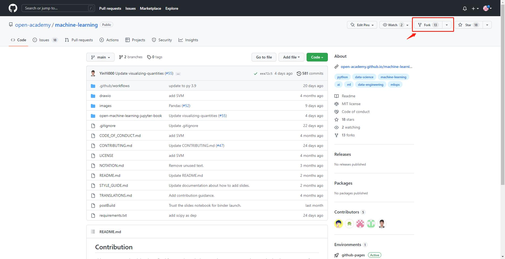
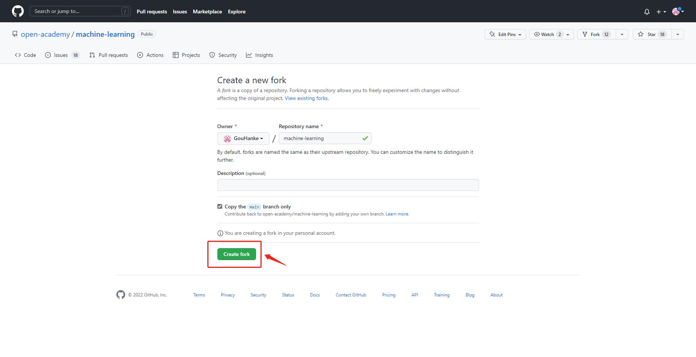
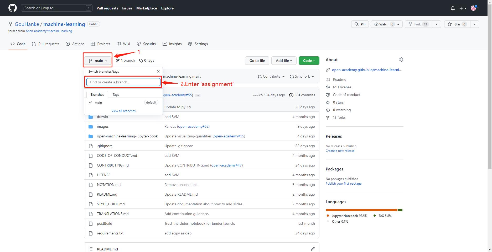
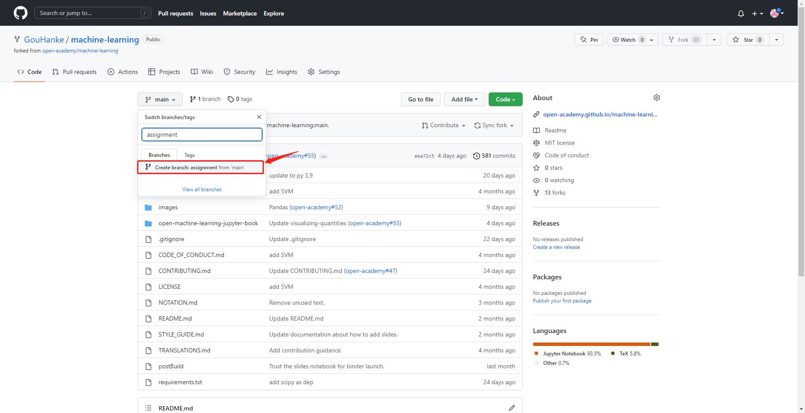
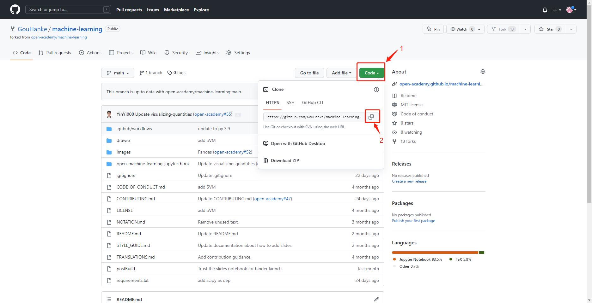
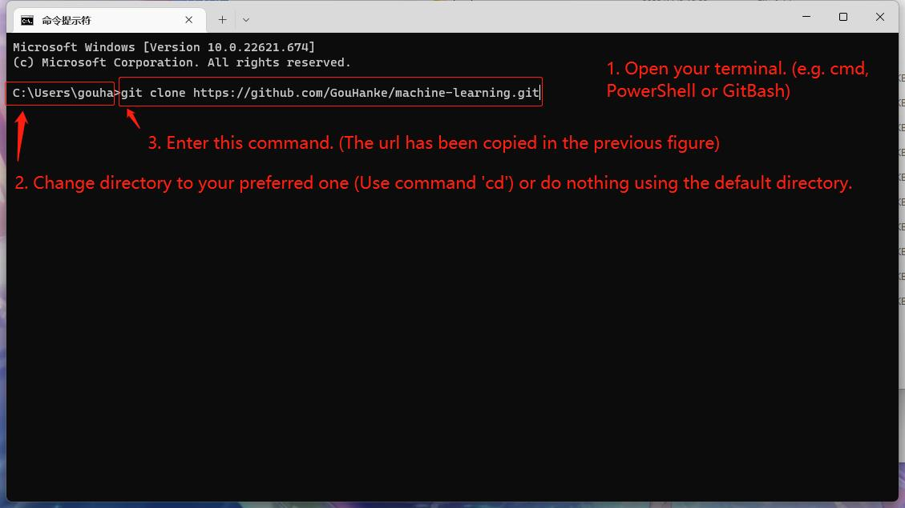
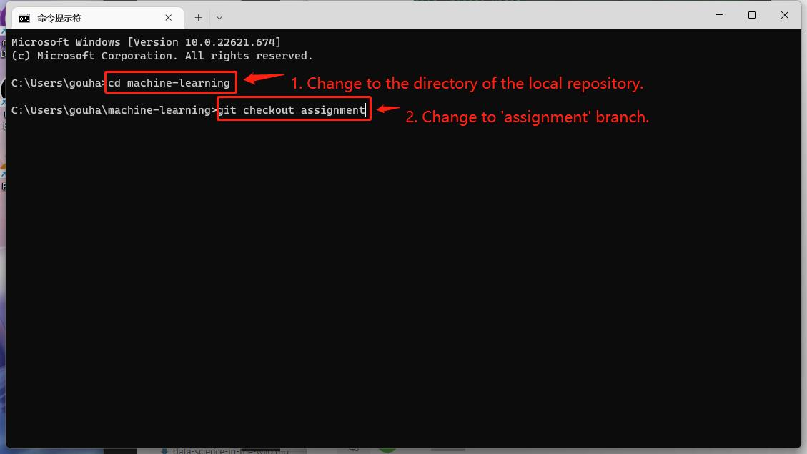
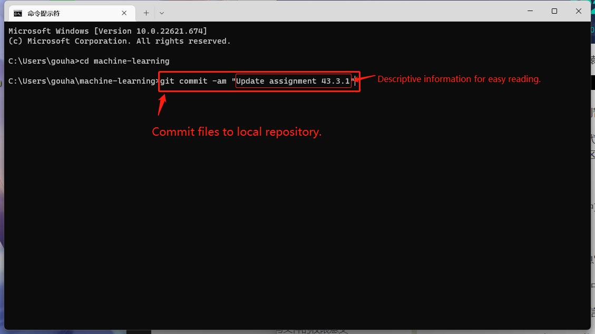
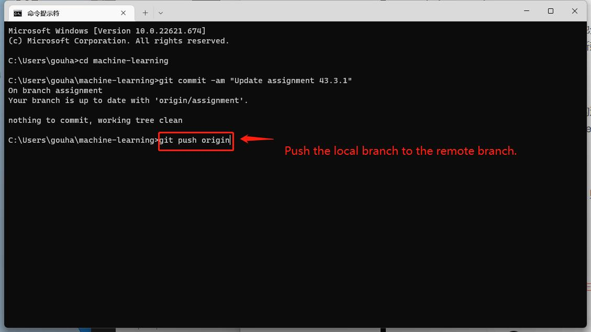

# Get started

To start working on the assignments, you could follow the  steps below:

1. (First time only) Fork the [open-academy/machine-learning](https://github.com/open-academy/machine-learning) under your own GitHub account.


2. (First time only) Create a test branch on your repo forked above, which MUST be named as `assignment`.


3. (First time only) Enable GitHub Actions for your forked repository.
4. (First time only) Clone the repo to your local, and switch to the `assignment` branch.



5. Work on the assignment locally by following the instructions provided in the Jupyter notebook. Test your code by executing the corresponding notebook cells inside the assignment.
6. Make sure that your code can pass local test, by taping in the terminal : <br>
    ```shell
   pytest --nbmake <YOUR-ASSIGNMENT-JUPYTER-FILE>.ipynb
   ```
7. Commit & push the local changes to remote once you finish the assignment.


8. A GitHub Action will be triggered automatically, and the result will be shown on your forked repo at GitHub.

Starting from your second assignment, you need only follow 
Step 5-Step 8.

You don't need to finish all the assignments at the same time. Only the changed file will trigger the verification from GitHub after being pushed to the remote. You could also debug the code by checking the error log from the GitHub Action execution.

```{seealso}
- [How to fork a GitHub repo?](https://docs.github.com/en/get-started/quickstart/fork-a-repo)
- [How to check GitHub Action result?](https://docs.github.com/en/actions/quickstart#viewing-your-workflow-results)
```

## How does this work?

The assignment is fully automated by leveraging GitHub Action. The action is defined by [assignment.yml](https://github.com/open-academy/machine-learning/blob/main/.github/workflows/assignment.yml), which handles the continuous integration workflow post a code push. It listens to the code change under `open-machine-learning-jupyter-book/assignments` path, gets the changed files, and runs unit testing against them.

`pytest` is the testing framework used for the assignments. To support unit testing for the Jupyter Notebook, `nbmake` is used as a plugin together with `pytest`.

```{seealso}
- [pytest - makes it easy to write small, readable tests, and can scale to support complex functional testing for applications and libraries.](https://docs.pytest.org/)
- [GitHub - treebeardtech/nbmake: Pytest plugin for testing notebooks](https://github.com/treebeardtech/nbmake)
```
