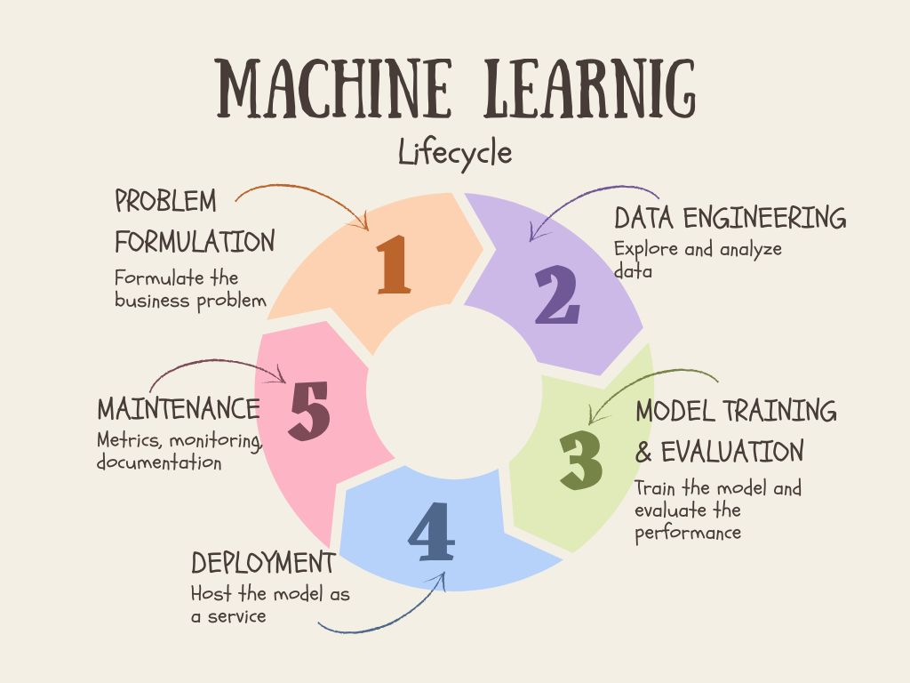

# Overview

## Machine Learning Operations Overview

Productionization of a Machine Learning solution is not a one time thing. It is always under improving  through the iterative process continuously.

```{epigraph}
Machine learning is a highly iterative process: you may try many dozens of ideas before finding one that you're satisfied with.

-- Andrew Ng
```

Machine Learning lifecycle could be mapped and fit to traditional software development process. Better understanding of Machine Learning will help you as you think about how to incorporate machine learning, including models, into your software development processes.

A Machine Learning lifecycle consists of such major phases, including,

- Problem Definition,
- Data Engineering,
- Model Training & Evaluation,
- Deployment,
- Maintenance.



## Problem Definition


## Data Engineering

## Model Training & Evaluation

## Deployment

## Maintenance
