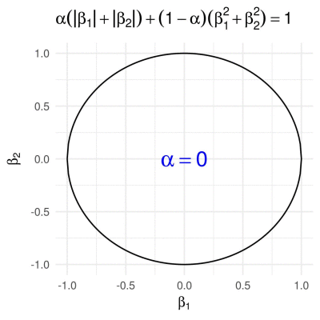
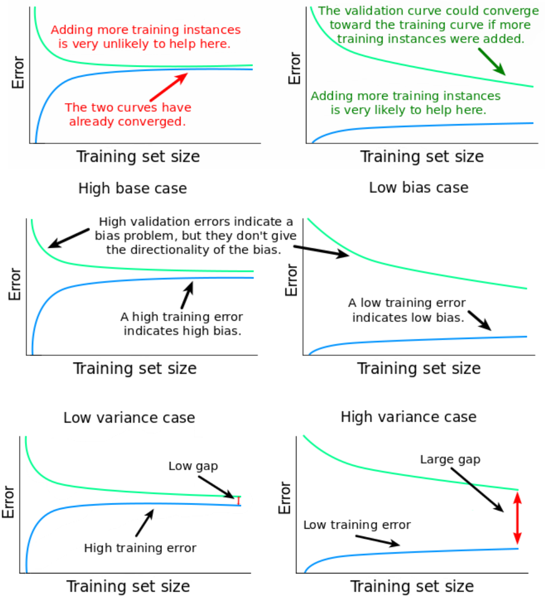

# Model selection


## Over-fitting and under-fitting

### Overview

:::{figure-md} Over-fitting-regression-ms


Over-fitting and under-fitting in regression {cite}`overview_rggegularization`
:::


:::{figure-md} Over-fitting-classification-ms


Over-fitting and under-fitting in classification {cite}`AndreasMaier`
:::

### A simple example of linear regression 

:::{figure-md} Datapoints-ms


Training data points {cite}`DavidPraise`
:::

:::{figure-md} Over-fitting-train-ms


Over-fitting model fits very well on training data {cite}`DavidPraise`
:::


:::{figure-md} Over-fitting-test-ms


Over-fitting model fits poorly on test data {cite}`DavidPraise`
:::


:::{figure-md} Under-fitting-train-ms


Under-fitting model fits poorly on training data {cite}`DavidPraise`
:::

:::{figure-md} Under-fitting-test-ms


Under-fitting model fits poorly on test data {cite}`DavidPraise`
:::


:::{figure-md} Perfect-fitting-train-ms


Perfect-fitting model fits well on training data {cite}`DavidPraise`
:::

:::{figure-md} Perfect-fitting-test-ms


Perfect-fitting model fits well on test data {cite}`DavidPraise`
:::

## Bias variance tradeoff

:::{figure-md} graphicalillustration-ms


Graphical illustration of variance and bias {cite}`ScottFortmannRoe`
:::


:::{figure-md} Model-complexity-ms


Model complexity v.s. error {cite}`ScottFortmannRoe`
:::


## L1 and L2 Regularization

$$L2\ Loss = Loss + \textcolor{red}{\lambda}\sum_{i} w_i^2$$

$$L1\ Loss = Loss + \textcolor{red}{\lambda}\sum_{i} \lvert w \rvert$$


:::{figure-md} circlesquare-ms


L1 and L2 regularization {cite}`ScottFortmannRoe`
:::


:::{figure-md} explainedairegularization-ms


L1 and L2 regularization  {cite}`explainedairegularization`
:::


:::{figure-md} berkeley189s21-ms


Different $\beta$ and ellipses {cite}`berkeley189s21`
:::


:::{figure-md} p-norm_balls-ms


Different p norm {cite}`Alexej`
:::


:::{figure-md} ElasticNet-ms


ElasticNet {cite}`Alexej`
:::


### The impact of the value of $\lambda$ 

:::{figure-md} impact-of-lambda-ms


The impact of the value of $\lambda$  {cite}`explainedairegularization`
:::

## Early stopping

:::{figure-md} EarlyStopping-ms


Early stopping {cite}`ArdenDertat`
:::


## Dropout


:::{figure-md} Dropout-ms


Dropout {cite}`kaggle_get_started`
:::


### Prediction after dropout

:::{figure-md} Prediction-after-dropout-ms


Prediction after dropout {cite}`DmytroPrylipko`
:::


During training, p neuron activations (usually, p=0.5, so 50%) are dropped. Doing this at the testing stage is not our goal (the goal is to achieve a better generalization). From the other hand, keeping all activations will lead to an input that is unexpected to the network, more precisely, too high (50% higher) input activations for the following layer {cite}`DmytroPrylipko`. 

Consider the neurons at the output layer. During training, each neuron usually get activations only from two neurons from the hidden layer (while being connected to four), due to dropout. Now, imagine we finished the training and remove dropout. Now activations of the output neurons will be computed based on four values from the hidden layer. This is likely to put the output neurons in unusual regime, so they will produce too large absolute values, being overexcited {cite}`DmytroPrylipko`.

To avoid this, the trick is to multiply the input connections' weights of the last layer by 1-p (so, by 0.5). Alternatively, one can multiply the outputs of the hidden layer by 1-p, which is basically the same {cite}`DmytroPrylipko`.


## Conclusions


:::{figure-md} Training-size-matters-ms


Training size matters {cite}`ZahidHasan`
:::


:::{figure-md} Steps-ms


How to choose a good model {cite}`ZahidHasan`
:::


:::{figure-md} Conclusion-ms


Conclusion {cite}`elitedatascience`
:::


<div hidden>
https://github.com/bhattbhavesh91/dropout-walkthrough/

https://github.com/Coding-Lane/L2-Regularization


</div>


<div hidden>
TODO:

Cross validation

Data Size Matters


</div>


<div hidden>

Machine Learning Tutorial Python - 20: Bias vs Variance In Machine Learning:
https://www.youtube.com/watch?v=B01qMFMAgUQ

Bias-Variance Tradeoff, Model Flexibility, Overfitting:
https://www.youtube.com/watch?v=T9DEGThjDkI

Bias/Variance (C2W1L02):
https://www.youtube.com/watch?v=SjQyLhQIXSM

Machine Learning Tutorial Python - 17: L1 and L2 Regularization | Lasso, Ridge Regression :
https://www.youtube.com/watch?v=VqKq78PVO9g

Intuitive Explanation of Ridge / Lasso Regression:
https://www.youtube.com/watch?v=9LNpiiKCQUo

L1 and L2 Regularization CIS 522 - Deep Learning:
https://www.youtube.com/watch?v=OLl2nzOeQ68

Thierry Slides Week 6, Week 1

Ridge, Lasso, Cross validation

Early Stopping, Dropout,


</div>

---

```{bibliography}
:filter: docname in docnames
```
