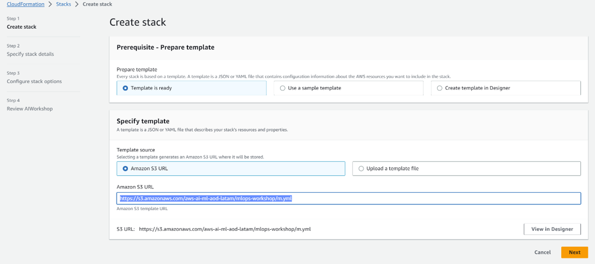
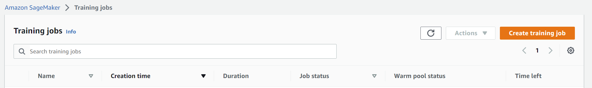

<details>

<summary><b>LICENSE</b></summary>

Copyright 2019 Amazon.com, Inc. or its affiliates. All Rights Reserved.

Permission is hereby granted, free of charge, to any person obtaining a copy of this
software and associated documentation files (the "Software"), to deal in the Software
without restriction, including without limitation the rights to use, copy, modify,
merge, publish, distribute, sublicense, and/or sell copies of the Software, and to
permit persons to whom the Software is furnished to do so.

THE SOFTWARE IS PROVIDED "AS IS", WITHOUT WARRANTY OF ANY KIND, EXPRESS OR IMPLIED,
INCLUDING BUT NOT LIMITED TO THE WARRANTIES OF MERCHANTABILITY, FITNESS FOR A
PARTICULAR PURPOSE AND NONINFRINGEMENT. IN NO EVENT SHALL THE AUTHORS OR COPYRIGHT
HOLDERS BE LIABLE FOR ANY CLAIM, DAMAGES OR OTHER LIABILITY, WHETHER IN AN ACTION
OF CONTRACT, TORT OR OTHERWISE, ARISING FROM, OUT OF OR IN CONNECTION WITH THE
SOFTWARE OR THE USE OR OTHER DEALINGS IN THE SOFTWARE.

</details>

# Amazon sagemaker mlops workshop warm-up

## Instructions

Amazon SageMaker is a cloud service for Machine Learning provided by Amazon Web Services (AWS). It offers a complete platform that helps users build, train, and deploy Machine Learning models, along with a range of tools and algorithms that make Machine Learning more accessible and scalable.

We will learn [amazon-sagemaker-mlops-workshop](https://github.com/awslabs/amazon-sagemaker-mlops-workshop/) provided by AWS Labs to help users understand the Machine Learning workflow on the Amazon SageMaker platform. The project covers a series of work steps, from data preparation to model development and deployment, and also presents best practices for managing Machine Learning workflows in production. The project is mainly divided into the following parts:

1. Data Preparation: In this section, you will learn how to prepare a Machine Learning dataset and use Amazon SageMaker Data Labeling Tool for data labeling.
2. Model Development: In this section, you will develop and train Machine Learning models using Amazon SageMaker Notebook instances, as well as optimize models using Amazon SageMaker Automatic Model Tuning feature.
3. Model Evaluation and Interpretation: In this section, you will learn how to evaluate and interpret Machine Learning models using Amazon SageMaker model monitoring and interpretation features.
4. Model Deployment and Management: In this section, you will learn how to deploy trained models to production environments using Amazon SageMaker model deployment feature, and manage Machine Learning workflows using Amazon SageMaker management feature.

## Warm-up section

### Step 1 - initialize the cloud environment with CloudFormation 

First, click to enter the open source project [amazon-sagemaker-mlops-workshop](https://github.com/awslabs/amazon-sagemaker-mlops-workshop/), and you can find the Launch Stack button in the Instructions section of the README.md file.


Click the Launch Stack button, which will create the required S3 dataset and SageMaker in the cloud, then create a subnet and set the corresponding permissions so that they can access each other.

Then, enter [Amazon S3 URL](https://s3.amazonaws.com/aws-ai-ml-aod-latam/mlops-workshop/m.yml) to download the YAML file to the local.



After that, open the YAML file, since we do not need to use the high-end instance type like ml.m4.xlarge, we need to change InstanceType: "ml.m4.xlarge" to “ml.t2.medium” in the file.


```{note}
If using ml.m4.xlarge, the notebook creation will not be successful.
```

Then, we can add the modified YAML file by clicking on the "Upload a template file" button.

Subsequently, we need to set the NotebookInstanceSecGroupId parameter.


```{note}
If a private subnet is not configured, SageMaker Notebook instances cannot access other resources within the same subnet or within a VPC with permissions.
```

In AWS CloudFormation, NotebookInstanceSecGroupId is a parameter used to specify the security group ID for SageMaker Notebook instances. Security groups are virtual firewalls used to control inbound and outbound network traffic to EC2 instances. Since SageMaker Notebook instances run on EC2 instances, a security group is required to control network traffic.
The default value for the NotebookInstanceSecGroupId parameter is to select the "default security group". The default security group is automatically created when a VPC is created and allows all traffic to pass. If the default security group is selected, SageMaker Notebook instances can be accessed from all IP addresses.

the NotebookInstanceSubnetId parameter is used to specify the subnet where SageMaker Notebook instances are deployed, improving security and availability by deploying them in the specified network location.

Finally, wait for the stack to be created. The creation process may take a few minutes. When the stack status changes to "CREATE_COMPLETE", you can move on to the next step in the project.

### Step 2 - open Jupyter Notebook

Enter Amazon SageMaker, then enter Notebook instances, we can see that a new notebook is created.


Click "Open JupyterLab" to start the warmup exercises.

### Step 3 - start warm-up section

You can see the four files required to complete the warmup under the path  `lab/00_Warmup/`.

After running the code for uploading data, the data `iris_train.csv` and `iris_test.csv` will be uploaded to the Buckets of Amazon S3.


After running the code for training the model, the model will be trained in Amazon SageMaker. 
Enter Training jobs to see the model (picture) being trained. 



The input data is the `iris_train.csv` previously created in Amazon S3.

## Acknowledgments

Thanks to Amazon Web Services - Labs for creating the open-source project [amazon-sagemaker-mlops-workshop](https://github.com/awslabs/amazon-sagemaker-mlops-workshop/). It inspires the majority of the content in this chapter.
