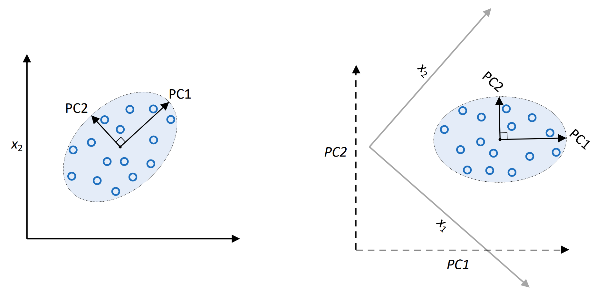
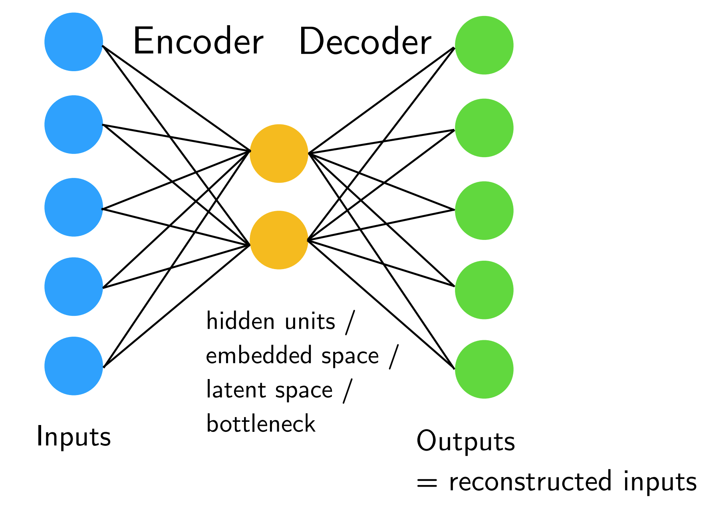
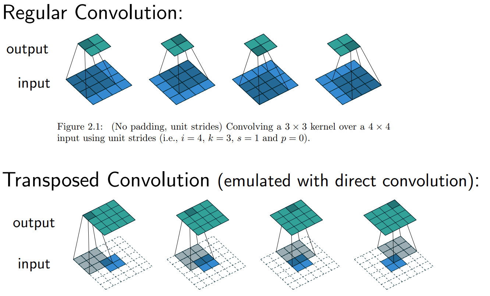
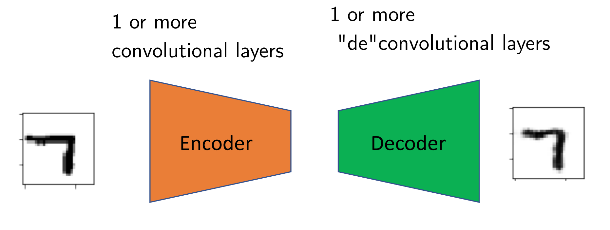

---
jupytext:
  cell_metadata_filter: -all
  formats: md:myst
  text_representation:
    extension: .md
    format_name: myst
    format_version: 0.13
    jupytext_version: 1.11.5
kernelspec:
  display_name: Python 3
  language: python
  name: python3
---

# Autoencoder

## Overview

An autoencoder is a type of artificial neural network used to learn efficient codings of unlabeled data (unsupervised learning). An autoencoder learns two functions: an encoding function that transforms the input data, and a decoding function that recreates the input data from the encoded representation. The autoencoder learns an efficient representation (encoding) for a set of data, typically for dimensionality reduction.

## Unsupervised Learning

Autoencoder is a kind of unsupervised learning, which means working with datasets without considering a target variable. There are some Applications and Goals for it:

- Finding hidden structures in data.
- Data compression.
- Clustering.
- Retrieving similar objects.
- Exploratory data analysis.
- Generating new examples.

And for unsupervised learning, its main Principal Component Analysis (PCA) is:

- Find directions of maximum variance

:::{figure-md} 01_PCA1


Illustration of PCA
:::

- Transform features onto directions of maximum variance

:::{figure-md} 02_PCA2


Illustration of PCA
:::

- Usually consider a subset of vectors of most variance (dimensionality reduction)

:::{figure-md} 03_PCA3


Illustration of PCA
:::

## Fully-connected Autoencoder

Here is an example of a basic fully-connected autoencoder

:::{figure-md} 04_simple


Illustration of Fully Connected autoencoder
:::

```{note}
If we don't use non-linear activation functions and minimize the MSE, this is very similar to PCA. However, the latent dimensions will not necessarily be orthogonal and will have same variance.
```

The loss function of this simple model is $L(x, x^') = ||x - x^'||^2_2 = \sum_i (x_i - x_i^')^2$.

### Potential Autoencoder Applications

And there are some potential autoencoder applications, for example:
- After training, disregard the output part, we can use embedding as input to classic machine learning methods (SVM, KNN, Random Forest, ...).
- Similar to transfer learning, we can train autoencoder on large image dataset, then fine tune encoder part on your own, smaller dataset and/or provide your own output (classification) layer.
- Latent space can also be used for visualization (EDA, clustering), but there are better methods for that.

## Convolutional Autoencoder

For convolutional autoencoder, we mainly use transposed convolution construct the output, and transposed convolution (sometimes called "deconvolution") allows us to increase the size of the output feature map compared to the input feature map.

The difference between regular convolution and transposed convolution can be seen from the following image.

:::{figure-md} 05_diff_conv


Difference between regular and transposed convolution
:::

In transposed convolutions, we stride over the output; hence, larger strides will result in larger outputs (opposite to regular convolutions); and we pad the output; hence, larger padding will result in smaller output maps.

So, the whole model consists of two parts, encoder and decoder, and they are composed with regular convolution and transposed convolution respectively.

:::{figure-md} 06_convmodel


Structure of convoluted autoencoder
:::

```{note}
Here is some other tricks to help our training:
1. Add dropout layers to force networks to learn redundant features.
2. Add dropout after the input, or add noise to the input to learn to denoise images.
3. Add L1 penalty to the loss to learn sparse feature representations.
```

## Code

Let's build a 2-layers auto-encoder with TensorFlow to compress images to a lower latent space and then reconstruct them. And this project will be done on MNIST dataste.

```{code-cell}
import tensorflow as tf
import numpy as np
```

MNIST Dataset parameters.

```{code-cell}
num_features = 784 # data features (img shape: 28*28).
```

Training parameters.

```{code-cell}
learning_rate = 0.01
training_steps = 20000
batch_size = 256
display_step = 1000
```

Network Parameters

```{code-cell}
num_hidden_1 = 128 # 1st layer num features.
num_hidden_2 = 64 # 2nd layer num features (the latent dim).
```

Prepare MNIST data.

```{code-cell}
from tensorflow.keras.datasets import mnist
(x_train, y_train), (x_test, y_test) = mnist.load_data()
# Convert to float32.
x_train, x_test = x_train.astype(np.float32), x_test.astype(np.float32)
# Flatten images to 1-D vector of 784 features (28*28).
x_train, x_test = x_train.reshape([-1, num_features]), x_test.reshape([-1, num_features])
# Normalize images value from [0, 255] to [0, 1].
x_train, x_test = x_train / 255., x_test / 255.
```

Store layers weight & bias.
A random value generator to initialize weights.

```{code-cell}
random_normal = tf.initializers.RandomNormal()

weights = {
    'encoder_h1': tf.Variable(random_normal([num_features, num_hidden_1])),
    'encoder_h2': tf.Variable(random_normal([num_hidden_1, num_hidden_2])),
    'decoder_h1': tf.Variable(random_normal([num_hidden_2, num_hidden_1])),
    'decoder_h2': tf.Variable(random_normal([num_hidden_1, num_features])),
}
biases = {
    'encoder_b1': tf.Variable(random_normal([num_hidden_1])),
    'encoder_b2': tf.Variable(random_normal([num_hidden_2])),
    'decoder_b1': tf.Variable(random_normal([num_hidden_1])),
    'decoder_b2': tf.Variable(random_normal([num_features])),
}
```

Building the encoder.

```{code-cell}
def encoder(x):
    # Encoder Hidden layer with sigmoid activation.
    layer_1 = tf.nn.sigmoid(tf.add(tf.matmul(x, weights['encoder_h1']),
                                   biases['encoder_b1']))
    # Encoder Hidden layer with sigmoid activation.
    layer_2 = tf.nn.sigmoid(tf.add(tf.matmul(layer_1, weights['encoder_h2']),
                                   biases['encoder_b2']))
    return layer_2
```

Building the decoder.

```{code-cell}
def decoder(x):
    # Decoder Hidden layer with sigmoid activation.
    layer_1 = tf.nn.sigmoid(tf.add(tf.matmul(x, weights['decoder_h1']),
                                   biases['decoder_b1']))
    # Decoder Hidden layer with sigmoid activation.
    layer_2 = tf.nn.sigmoid(tf.add(tf.matmul(layer_1, weights['decoder_h2']),
                                   biases['decoder_b2']))
    return layer_2
```

Mean square loss between original images and reconstructed ones.

```{code-cell}
def mean_square(reconstructed, original):
    return tf.reduce_mean(tf.pow(original - reconstructed, 2))
```

Adam optimizer.

```{code-cell}
optimizer = tf.optimizers.Adam(learning_rate=learning_rate)
```


Optimization process. 

```{code-cell}
def run_optimization(x):
    # Wrap computation inside a GradientTape for automatic differentiation.
    with tf.GradientTape() as g:
        reconstructed_image = decoder(encoder(x))
        loss = mean_square(reconstructed_image, x)

    # Variables to update, i.e. trainable variables.
    trainable_variables = weights.values() + biases.values()
    
    # Compute gradients.
    gradients = g.gradient(loss, trainable_variables)
    
    # Update W and b following gradients.
    optimizer.apply_gradients(zip(gradients, trainable_variables))
    
    return loss
```

Run training for the given number of steps.

```{code-cell}
for step, (batch_x, _) in enumerate(train_data.take(training_steps + 1)):
    
    # Run the optimization.
    loss = run_optimization(batch_x)
    
    if step % display_step == 0:
        print("step: %i, loss: %f" % (step, loss))
```

Testing and Visualization.

```{code-cell}
import matplotlib.pyplot as plt
```

Encode and decode images from test set and visualize their reconstruction.

```{code-cell}
n = 4
canvas_orig = np.empty((28 * n, 28 * n))
canvas_recon = np.empty((28 * n, 28 * n))
for i, (batch_x, _) in enumerate(test_data.take(n)):
    # Encode and decode the digit image.
    reconstructed_images = decoder(encoder(batch_x))
    # Display original images.
    for j in range(n):
        # Draw the generated digits.
        img = batch_x[j].numpy().reshape([28, 28])
        canvas_orig[i * 28:(i + 1) * 28, j * 28:(j + 1) * 28] = img
    # Display reconstructed images.
    for j in range(n):
        # Draw the generated digits.
        reconstr_img = reconstructed_images[j].numpy().reshape([28, 28])
        canvas_recon[i * 28:(i + 1) * 28, j * 28:(j + 1) * 28] = reconstr_img

print("Original Images")     
plt.figure(figsize=(n, n))
plt.imshow(canvas_orig, origin="upper", cmap="gray")
plt.show()

print("Reconstructed Images")
plt.figure(figsize=(n, n))
plt.imshow(canvas_recon, origin="upper", cmap="gray")
plt.show()
```

<div hidden>

https://github.com/reveurmichael/anomagram

https://anomagram.fastforwardlabs.com/#/

https://medium.datadriveninvestor.com/deep-learning-autoencoders-db265359943e

</div>


## Your turn! 🚀

TBD.

## Self study

You can refer to this book chapter for further study:

- [deeplearningbook](https://www.deeplearningbook.org/contents/autoencoders.html)

## Acknowledgments

Thanks to [Sebastian Raschka](https://github.com/rasbt) for creating the open-source project [stat453-deep-learning-ss20](https://github.com/rasbt/stat453-deep-learning-ss20) and [Aymeric Damien](https://github.com/aymericdamien) for creating the open-source project [TensorFlow-Examples](https://github.com/aymericdamien/TensorFlow-Examples/). They inspire the majority of the content in this chapter.

---

```{bibliography}
:filter: docname in docnames
```