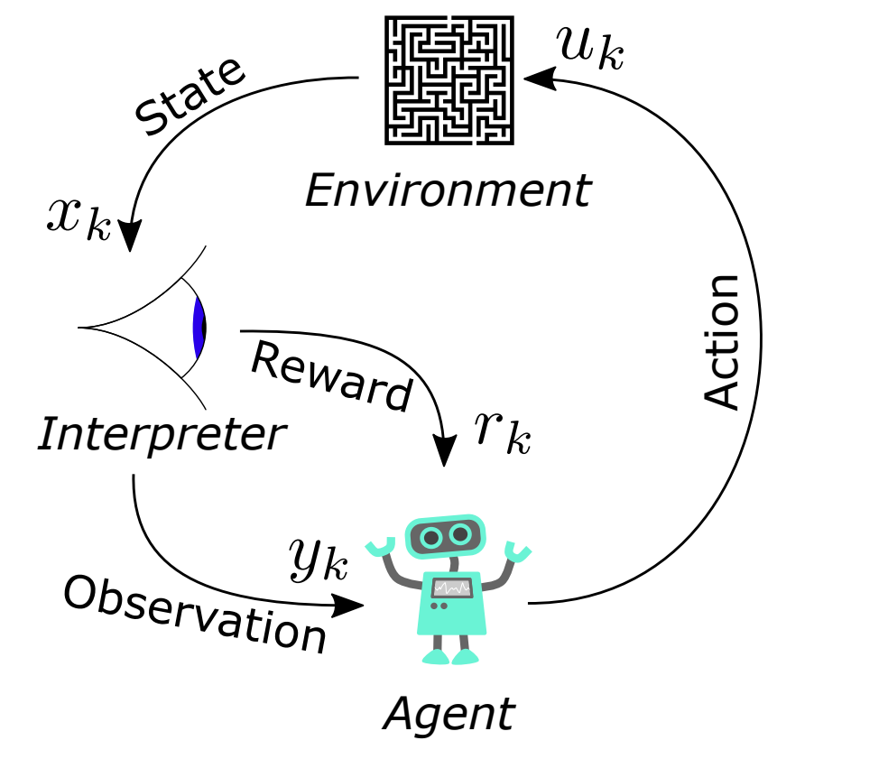
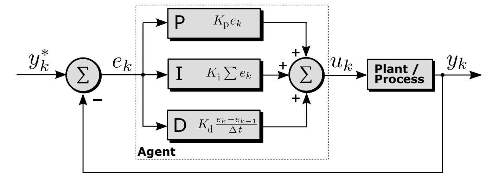
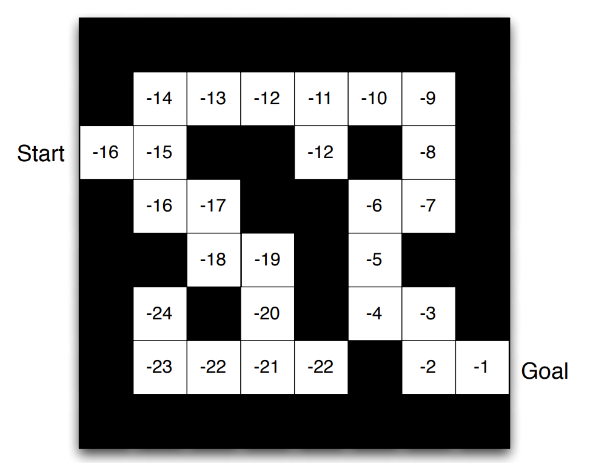
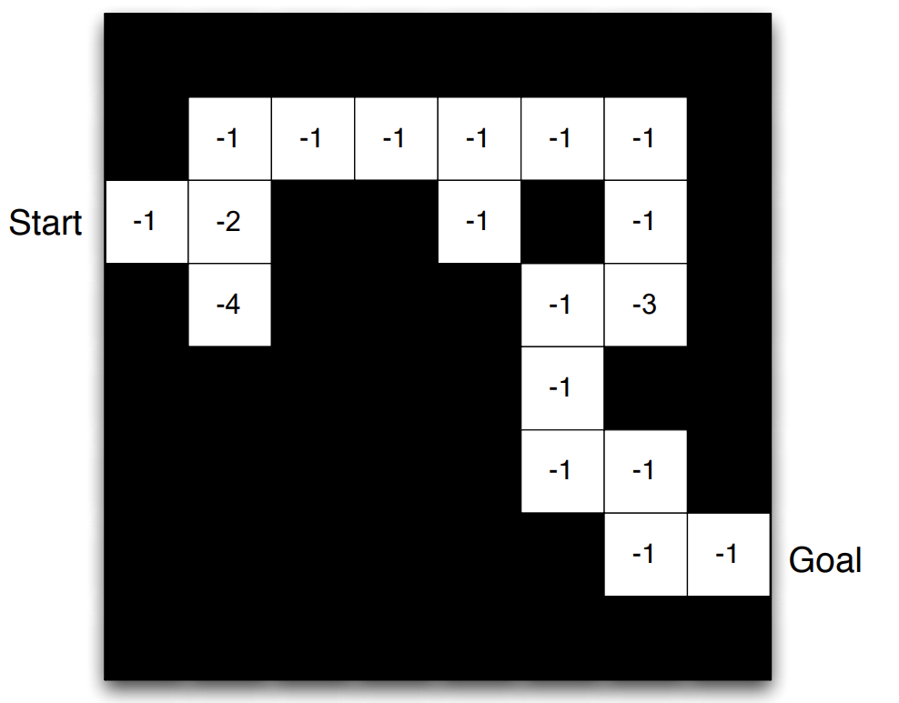
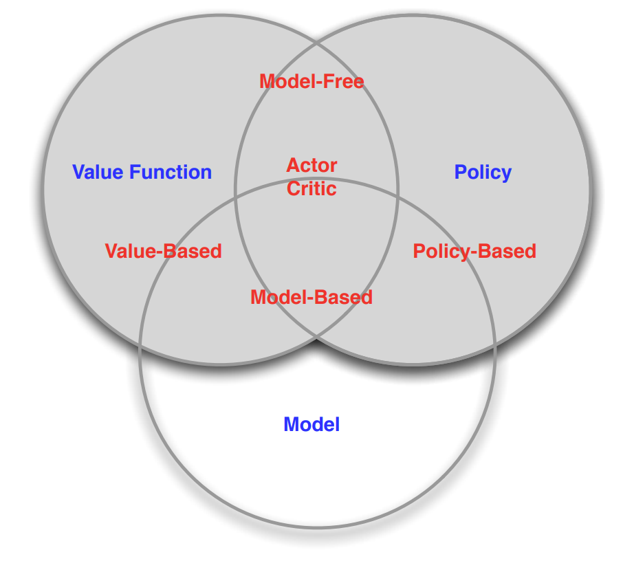
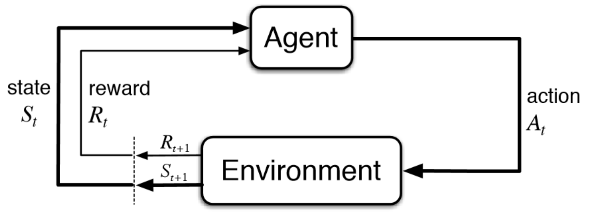

---
jupytext:
  cell_metadata_filter: -all
  formats: md:myst
  text_representation:
    extension: .md
    format_name: myst
    format_version: 0.13
    jupytext_version: 1.11.5
kernelspec:
  display_name: Python 3
  language: python
  name: python3
---

# Deep Q-learning

## Overview

Usually, we regard Deep Q Network as DQN, and it can also be called Reinforcement Learning (RL) whose aim is to achieve the desired behavior of an agent that learns from its mistakes and improves its performance. 

RL is a type of machine learning that allows us to create AI agents that learn from the environment by interacting with it to maximize its cumulative reward. Here is an image showing the basic RL operation principle:

:::{figure-md} 02_pipline


Pipline of DQN
:::

From this image, we can see that at each step $k$, the agent picks an action $u_k$, receives an observation $y_k$ and receives a reward $r_k$, and the environment receives an action $u_k$, emits an observation $y_{k+1}$ and emits a reward $r_{k+1}$. Later, the time increments k ← k + 1. A one step time delay is assumed between executing the action and receiving the observation as well as reward. We assume that the resulting time interval $∆t = t_k − t_{k+1}$ is constant.

```{note}
Key characteristics of RL:
- No supervisor.
- Data-driven.
- Discrete time steps.
- Sequential data stream (not independent and identically distributed data).
- Agent actions affect subsequent data (sequential decision making).
```

##  Basic terminology

### Reward

A reward is a scalar random variable $R_k$ with realizations $r_k$:

- Often it is considered a real-number $r_k \in \mathbb{R}$ or an integer $r_k \in \mathbb{Z}$.
- The reward function (interpreter) may be naturally given or is a design degree of freedom (i.e., can be manipulated).
- It fully indicates how well an RL agent is doing at step $k$.
- The agent’s task is to maximize its reward over time.

```{example}
If we want the machine to flip a pancake:
- Pos. reward: catching the 180◦ rotated pancake
- Neg. reward: droping the pancake on the floor
```

Rewards can have many different flavors and are highly depending on the given problem:

- Actions may have short and/or long term consequences.
- The reward for a certain action may be delayed.
- Examples: Stock trading, strategic board games,...
- Rewards can be positive and negative real values.
- Certain situations (e.g. car hits wall) might lead to a negative reward.
- Exogenous impacts might introduce stochastic reward components.
- Example: A wind gust pushes the helicopter into a tree.

Besides, the RL agent’s learning process is heavily linked with the reward distribution over time. Designing expedient rewards functions is therefore crucially important for successfully applying RL. And often there is no predefined way on how to design the “best reward function”.

### Task-dependent return definitions

#### Episodic tasks

Episodic tasks can naturally break into subsequences (finite horizon), for examples: most games, maze,... And the return becomes a finite sum: $g_k = r_{k+1} + r_{k+2} + ... + r_{N}$. Episodes end at their terminal step $k = N$.

#### Continuing tasks

Continuing tasks lack a natural end (infinite horizon), for example: process control task, and the return should be discounted to prevent infinite numbers: $g_k = r_{k+1} + \gamma r_{k+2} + \gamma^2 r_{k+3} + ... = \sum_{i=1}^{\infty} \gamma^{i} r_{k+i+1}$. Here, $\gamma ∈ {\mathbb{R}|0 ≤ \gamma ≤ 1}$ is the discount rate.

```{note}
From numeric viewpoint:
If $\gamma$ = 1 and $r_k$ > 0 for $k → \infty $, $g_k$ gets infinite.
If $\gamma$ < 1 and $r_k$ is bounded for $k → \infty$, $g_k$ is bounded.

From strategic viewpoint:
If $\gamma$ ≈ 1: agent is farsighted.
If $\gamma$ ≈ 0: agent is shortsighted (only interested in immediate reward).
```

### State

#### Environment state

Random variable $X_k^{e}$ with realizations $x_k^{e}$:

- Internal status representation of the environment, e.g.physical states (car velocity or motor current), game states (current chess board situation). financial states (stock market status).
- Fully, limited or not at all visible by the agent:sometimes even ’foggy’ or uncertain, but in general: $Y_k = f(X_k)$ as the measurable outputs of the environment.
- Continuous or discrete quantity.

#### Agent state

Random variable $X_k^{a}$ with realizations $x_k^{a}$:

- Internal status representation of the agent.
- In general: $x_k^{a} \neq x_k^{e}$, e.g., due to measurement noise or an additional agent’s memory.
- Agent’s condensed information relevant for next action.
- Dependent on internal knowledge / policy representation of the agent.
- Continuous or discrete quantity.

### Action

An action is the agent’s degree of freedom in order to maximize its reward. The major distinctions are: 
- Finite action set (FAS): $u_k ∈ {u_{k,1},u_{k,2}, ...} ∈ \mathbb{R}_m$.
- Continuous action set (CAS): Infinite number of actions: $u_k ∈ \mathbb{R}_m$.
- Deterministic $u_k$ or random Uk variable.
- Often state-dependent and potentially constrained: $u_k ∈ U(x_k) ⊆ \mathbb{R}_m$.

```{note}
Evaluating the state and action spaces (e.g., finite vs. continuous) of a new RL problem should be always the first steps in order to choose appropriate solution algorithms.
```

### Policy

A policy $\pi$ is the agent’s internal strategy on picking actions.
- Deterministic policies: maps state and action directly: $u_k = \pi (x_k)$. 
- Stochastic policies: maps a probability of the action given a state: $\pi(U_k|X_k) = \mathbb{P} [Uk|Xk]$ .
- RL is all about changing $\pi$ over time in order to maximize the expected return.

#### Example

Here is a deterministic policy example: find optimal gains ${K_p, K_i, K_d}$ given the reward $r_k = −e^2_k$
- Agent’s behavior is explicitly determined by ${K_p, K_i, K_d}$.
- Reference value is part of the environment state: $x_k =[y_k y^∗_k]^T$.
- Control output is the agent’s action: $u_k = \pi(x_k|K_p, K_i, K_d)$.

:::{figure-md} 03_policy_example


Classical PID control loop with scalar quantities
:::

### Value functions

The state-value function is the expected return being in state $x_k$ following a policy $\pi:v_{\pi}(x_k)$.

Assuming an MDP problem structure the state-value function is $v_{\pi}(x_k) = \mathbb{E}_{\pi} [G_k | X_k = x_k] = \mathbb{E}_{\pi}[\sum_{i=0}^{\infty} \gamma^i R_{k+i+1} | x_k]$.

The action-value function is the expected return being in state $x_k$ taken an action $u_k$ and, thereafter, following a policy $\pi: q_{\pi}(x_k,u_k)$.

Assuming an MDP problem structure the action-value function is $q_{\pi}(x_k, u_k) = \mathbb{E}_{\pi} [G_k | X_k=x_k, U_k=u_k] = \mathbb{E}_{\pi} [\sum_{i=0}^{\infty} \gamma^i R_{k+i+1} | x_k,u_k]$.

A key task in RL is to estimate $v_{\pi}(x_k)$ and $q_{\pi}(x_k,u_k)$ based on sampled data.

### Model

A model predicts what will happen inside an environment.

That could be a state model $\mathcal{P}$: $\mathcal{P} = \mathbb{P}[X_{k+1}=x_{k+1}|X_k=x_k, U_k=u_k]$. Or a reward model $\mathcal{R}$: $\mathcal{R} = \mathbb{P}[R_{k+1}=r_{k+1}|X_k=x_k, U_k=u_k]$. In general, those models could be stochastic (as denoted above) but in some problems relax to a deterministic form. Using data in order to fit a model is a learning problem of its own and often called system identification.

### Exploration and exploitation

In RL the environment is initially unknown. How to act optimal?
- Exploration: find out more about the environment.
- Exploitation: maximize current reward using limited information. 

```{note}
Trade-off problem: what’s the best split between both strategies? 
```

## Main algorithms

In this section, we will take maze as an example. The problem statement is:

- Reward: $r_k = −1$.
- At goal: episode termination.
- Actions: $u_k \in {N, E, S, W}$.
- State: agent’s location.
- Deterministic problem (no stochastic influences).

:::{figure-md} 04_maze


Maze setup statement
:::

### RL-solution by policy

:::{figure-md} 05_maze_policy


Maze solved by policy
:::

Key characteristics:
- For any state there is a direct action command.
- The policy is explicitly available.

### RL-solution by value function

:::{figure-md} 06_maze_valuefunc


Maze solved by value function
:::

Key characteristics:
- The agent evaluates neighboring maze positions by their value.
- The policy is only implicitly available.

### RL-solution by model evaluation

:::{figure-md} 07_maze_modeleval


Maze solved by model evaluation
:::

Key characteristics:
- Agent uses internal model of the environment.
- The model is only an estimate (inaccurate, incomplete).
- The agent interacts with the model before.

### RL agent taxonomy

:::{figure-md} 07_taxonomy


Main categories of reinforcement learning algorithms
:::

## Code

Cartpole Game is a classical example for RL and it is built on a Markov chain model that I give illustration below.

:::{figure-md} 01_cartpolegame


Illustration of cartpole game
:::

```{note}
Requires tensorflow==2.1.0
```

```{code-cell}
import numpy as np
import gym

from tensorflow.keras.models import Sequential
from tensorflow.keras.layers import Dense, Activation, Flatten
from tensorflow.keras.optimizers import Adam

from rl.agents.dqn import DQNAgent
from rl.policy import BoltzmannQPolicy
from rl.memory import SequentialMemory


ENV_NAME = 'CartPole-v0'


# Get the environment and extract the number of actions.
env = gym.make(ENV_NAME)
np.random.seed(123)
env.seed(123)
nb_actions = env.action_space.n

# Next, we build a very simple model.
model = Sequential()
model.add(Flatten(input_shape=(1,) + env.observation_space.shape))
model.add(Dense(16))
model.add(Activation('relu'))
model.add(Dense(16))
model.add(Activation('relu'))
model.add(Dense(16))
model.add(Activation('relu'))
model.add(Dense(nb_actions))
model.add(Activation('linear'))
print(model.summary())

# Finally, we configure and compile our agent. You can use every built-in tensorflow.keras optimizer and
# even the metrics!
memory = SequentialMemory(limit=50000, window_length=1)
policy = BoltzmannQPolicy()
dqn = DQNAgent(model=model, nb_actions=nb_actions, memory=memory, nb_steps_warmup=10,
               target_model_update=1e-2, policy=policy)
dqn.compile(Adam(learning_rate=1e-3), metrics=['mae'])

# Okay, now it's time to learn something! We visualize the training here for show, but this
# slows down training quite a lot. You can always safely abort the training prematurely using
# Ctrl + C.
dqn.fit(env, nb_steps=50000, visualize=True, verbose=2)

# After training is done, we save the final weights.
dqn.save_weights(f'dqn_{ENV_NAME}_weights.h5f', overwrite=True)

# Finally, evaluate our algorithm for 5 episodes.
dqn.test(env, nb_episodes=5, visualize=True)
```

## Your turn! 🚀

 TBD.

## Self study

You can refer to this website for further study:

- [Introduction to Reinforcement Learning](https://pylessons.com/CartPole-reinforcement-learning)

## Acknowledgments

Thanks to [Paderborn University - LEA](https://github.com/upb-lea) for creating the open-source course [reinforcement_learning_course_materials](https://github.com/upb-lea/reinforcement_learning_course_materials) and [YubiHunter](https://github.com/tensorneko) for creating the open-source project [keras-rl2](https://github.com/tensorneko/keras-rl2). They inspire the majority of the content in this chapter.

---

```{bibliography}
:filter: docname in docnames
```
