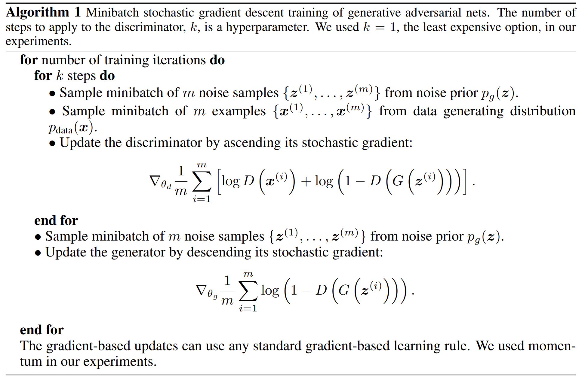

---
jupytext:
  cell_metadata_filter: -all
  formats: md:myst
  text_representation:
    extension: .md
    format_name: myst
    format_version: 0.13
    jupytext_version: 1.11.5
kernelspec:
  display_name: Python 3
  language: python
  name: python3
---

# Generative adversarial networks 

The original purpose of GAN is to generate new data. It classically generates new images, but is applicable to wide range of domains.
It learns the training set distribution and can generate new images that have never been seen before.
In contrast to e.g., autoregressive models or RNNs (generating one word at a time), GANs generate the whole output all at once.

```{seealso}
GAN is proposed in 2005, the paper is [Generative Adversarial Networks](https://arxiv.org/abs/1406.2661).
```

## overview

The structure of GAN is roughly as follows. It has two essential part, discriminator and generator. 
Discriminator learns to become better at distinguishing real from generated images, and generator learns to generate better images to fool the discriminator.

:::{figure-md} GAN structure


Illustration of GAN structure
:::

Then, one question appears: why Are GANs Are Called Generative Models?
-The generative part comes from the fact that the model "generates" new data,
- Usually, generative models use an approximation to compute the usually intractable distribution; here, the discriminator part does that approximation,
- So, it does learn p(x).

## Training

To make the model converge, we need to find a proper objective for it.
For the GAN, it is $\min\limits_{G} \max\limits_{D} V(D, G) = \mathbb{E}_{x \thicksim p_{data}}[log D(x)] + \mathbb{E}_{z\thicksim p_z(z)}[log(1-D(G(z)))]$

### Discriminator gradient for update (gradient ascent)

The aim of Discriminator is $\bigtriangledown_W_D \frac{1}{n} \sum_{i=1}^n [logD(x^{(i)}) + log(1-D(G(z^{(i)})))]$. We can split it into two parts.
First is $D(x^{(i)})$. If it predicts well in real images, the probability will be close to 1. 
Second is $D(G(z^{(i)}))$. This part use to predict the fake images which generdated from the generator, and if it predicts well, the probability will be close to 0.

### Generator gradient for update (gradient descent)

The aim of Generator is $\bigtringledown_W_G \frac{1}{n} \sum_{i=1}^n log(1-D(G(z^{(i)})))$. 
$D(G(z^{(i)}))$ is also used to predict fake images, but if it predicts badly on fake images, the probability will be close to 1, which is not same to discriminator.

### Algorithm

:::{figure-md} GAN algorithm


Algorithm of GAN
:::

GAN converges when probabilities are close to 0.5, which means G can cheat D.
rom a mathematical point of view, it converges when Nash-equilibrium (Game Theory concept) is reached in the minmax (zero-sum) game.
[Nash-Equilibrium](https://en.wikipedia.org/wiki/Nash_equilibrium) in Game Theory is reached when the actions of one player won't change depending on the opponent's actions.

But not each time GAN can converge, there are some training problems:
- Oscillation between generator and discriminator loss,
- Mode collapse (generator produces examples of a particular kind only),
- Discriminator is too strong, such that the gradient for the generator vanishes and the generator can't keep up,
- Discriminator is too weak, and the generator produces non-realistic images that fool it too easily (rare problem, though).

For the third problem, replacing $\bigtringledown_W_G \frac{1}{n} \sum_{i=1}^n log(1-D(G(z^{(i)})))$ with $\bigtringledown_W_G \frac{1}{n} \sum_{i=1}^n log(D(G(z^{(i)})))$ can be a good choice.

### Loss
Discriminator:
- Maximize prediction probability of classifying real as real and fake as fake,
- Remember maximizing log likelihood is the same as minimizing negative log likelihood (i.e., minimizing cross-entropy).
Generator:
- Minimize likelihood of the discriminator to make correct predictions (predict fake as fake; real as real), which can be achieved by maximizing the cross-entropy,
- This doesn't work well in practice though because of gradient issues (zero gradient if the discriminator makes correct predictions, which is not what we want for the generator),
- Better: flip labels and minimize cross entropy (force the discriminator to output high probability for fake if an image is real, and high probability for real if an image is fake).

