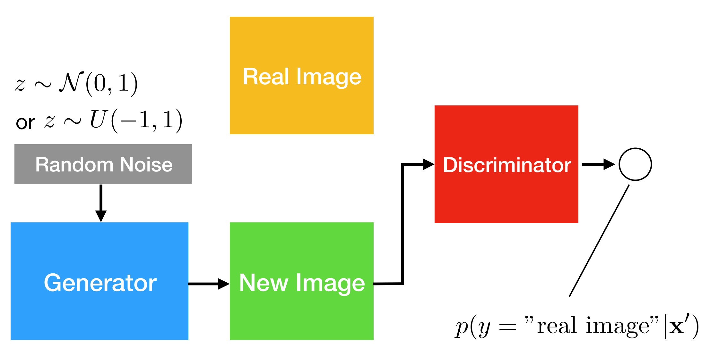

---
jupytext:
  cell_metadata_filter: -all
  formats: md:myst
  text_representation:
    extension: .md
    format_name: myst
    format_version: 0.13
    jupytext_version: 1.11.5
kernelspec:
  display_name: Python 3
  language: python
  name: python3
---

# Generative adversarial networks

The original purpose of Generative adversarial networks(GAN) is to generate new data. It classically generates new images, but is applicable to wide range of domains. It learns the training set distribution and can generate new images that have never been seen before. In contrast to e.g., autoregressive models or RNNs (generating one word at a time), GANs generate the whole output all at once.

```{seealso}
GAN is proposed in 2005, the paper is Ian J. Goodfellow, Jean Pouget-Abadie, Mehdi Mirza, Bing Xu, David Warde-Farley, Sherjil Ozair, Aaron Courville, Yoshua Bengio. "Generative Adversarial Networks", arxiv:1406.2661.
```

## Overview

The structures of GANs are roughly as follows. They have two essential part, discriminator and generator. 
Discriminator learns to become better at distinguishing real from generated images, and generator learns to generate better images to fool the discriminator.

:::{figure-md} GAN structure


Illustration of GAN structure
:::

Then, one question appears: why are GANs Called Generative Models?
- The generative part comes from the fact that the model "generates" new data,
- Most of the time, generative models use an approximation to compute the usually intractable distribution; here, the discriminator part does that approximation,
- So, it does learn p(x).

## Training

To make the model converge, we need to find a proper objective for it.
For the GAN, it is $\min\limits_{G} \max\limits_{D} V(D, G) = \mathbb{E}_{x \thicksim p_{data}}[log D(x)] + \mathbb{E}_{z\thicksim p_z(z)}[log(1-D(G(z)))]$

### Discriminator gradient for update (gradient ascent)

The aim of Discriminator is $\bigtriangledown_{W_D} \frac{1}{n} \sum_{i=1}^n [log D(x^{(i)}) + log (1-D(G(z^{(i)})))]$. We can split it into two parts.
First is $D(x^{(i)})$. If it predicts well in real images, the probability will be close to $1$. 
Second is $D(G(z^{(i)}))$. This part use to predict the fake images which generdated from the generator, and if it predicts well, the probability will be close to $0$.

### Generator gradient for update (gradient descent)

The aim of Generator is $\bigtriangledown_{W_G} \frac{1}{n} \sum_{i=1}^n log(1-D(G(z^{(i)})))$. 
$D(G(z^{(i)}))$ is also used to predict fake images, but if it predicts badly on fake images, the probability will be close to 1, which is not same to discriminator.

### Train for convergence

GAN converges when probabilities are close to 0.5, which means G can cheat D.
rom a mathematical point of view, it converges when Nash-equilibrium (Game Theory concept) is reached in the minmax (zero-sum) game.
[Nash-Equilibrium](https://en.wikipedia.org/wiki/Nash_equilibrium) in Game Theory is reached when the actions of one player won't change depending on the opponent's actions.

But not each time GAN can converge, there are some training problems:
- Oscillation between generator and discriminator loss,
- Mode collapse (generator produces examples of a particular kind only),
- Discriminator is too strong, such that the gradient for the generator vanishes and the generator can't keep up,
- Discriminator is too weak, and the generator produces non-realistic images that fool it too easily (rare problem, though).

For the third problem, replacing $\bigtriangledown_{W_G} \frac{1}{n} \sum_{i=1}^n log(1-D(G(z^{(i)})))$ with $\bigtriangledown_{W_G} \frac{1}{n} \sum_{i=1}^n log(D(G(z^{(i)})))$ can be a good choice.

### Loss

Discriminator:
- Maximize prediction probability of classifying real as real and fake as fake,
- Remember maximizing log likelihood is the same as minimizing negative log likelihood (i.e., minimizing cross-entropy).
Generator:
- Minimize likelihood of the discriminator to make correct predictions (predict fake as fake; real as real), which can be achieved by maximizing the cross-entropy,
- This doesn't work well in practice though because of gradient issues (zero gradient if the discriminator makes correct predictions, which is not what we want for the generator),
- Better: flip labels and minimize cross entropy (force the discriminator to output high probability for fake if an image is real, and high probability for real if an image is fake).

### Code

Here we implement a GAN model.

```{code-cell}
from IPython import display

from torch.utils.data import DataLoader
from torchvision import transforms, datasets

from utils import Logger

import tensorflow as tf
import tensorflow.compat.v1 as tf
tf.disable_v2_behavior() 

import numpy as np
from tensorflow.examples.tutorials.mnist import input_data

mnist=input_data.read_data_sets('./tf_data/VGAN/MNIST',one_hot=True)
DATA_FOLDER = './tf_data/VGAN/MNIST'
IMAGE_PIXELS = 28*28
NOISE_SIZE = 100
BATCH_SIZE = 100

def noise(n_rows, n_cols):
    return np.random.normal(size=(n_rows, n_cols))

def xavier_init(size):
    in_dim = size[0] if len(size) == 1 else size[1]
    stddev = 1. / np.sqrt(float(in_dim))
    return tf.random_uniform(shape=size, minval=-stddev, maxval=stddev)

def images_to_vectors(images):
    return images.reshape(images.shape[0], 784)

def vectors_to_images(vectors):
    return vectors.reshape(vectors.shape[0], 28, 28, 1)
```

Load Data

```{code-cell}
def mnist_data():
    compose = transforms.Compose(
        [transforms.ToTensor(),
         transforms.Normalize((.5,), (.5,))
        ])
    out_dir = '{}/dataset'.format(DATA_FOLDER)
    return datasets.MNIST(root=out_dir, train=True, transform=compose, download=True)

# Load data
data = mnist_data()
# Create loader with data, so that we can iterate over it
data_loader = DataLoader(data, batch_size=BATCH_SIZE, shuffle=True)
# Num batches
num_batches = len(data_loader)
```

Initialize Graph

```{code-cell}
## Discriminator

# Input
X = tf.placeholder(tf.float32, shape=(None, IMAGE_PIXELS))

# Layer 1 Variables
D_W1 = tf.Variable(xavier_init([784, 1024]))
D_B1 = tf.Variable(xavier_init([1024]))

# Layer 2 Variables
D_W2 = tf.Variable(xavier_init([1024, 512]))
D_B2 = tf.Variable(xavier_init([512]))

# Layer 3 Variables
D_W3 = tf.Variable(xavier_init([512, 256]))
D_B3 = tf.Variable(xavier_init([256]))

# Out Layer Variables
D_W4 = tf.Variable(xavier_init([256, 1]))
D_B4 = tf.Variable(xavier_init([1]))

# Store Variables in list
D_var_list = [D_W1, D_B1, D_W2, D_B2, D_W3, D_B3, D_W4, D_B4]

## Generator

# Input
Z = tf.placeholder(tf.float32, shape=(None, NOISE_SIZE))

# Layer 1 Variables
G_W1 = tf.Variable(xavier_init([100, 256]))
G_B1 = tf.Variable(xavier_init([256]))

# Layer 2 Variables
G_W2 = tf.Variable(xavier_init([256, 512]))
G_B2 = tf.Variable(xavier_init([512]))

# Layer 3 Variables
G_W3 = tf.Variable(xavier_init([512, 1024]))
G_B3 = tf.Variable(xavier_init([1024]))

# Out Layer Variables
G_W4 = tf.Variable(xavier_init([1024, 784]))
G_B4 = tf.Variable(xavier_init([784]))

# Store Variables in list
G_var_list = [G_W1, G_B1, G_W2, G_B2, G_W3, G_B3, G_W4, G_B4]

def discriminator(x):
    l1 = tf.nn.dropout(tf.nn.leaky_relu(tf.matmul(x,   D_W1) + D_B1, .2), .3)
    l2 = tf.nn.dropout(tf.nn.leaky_relu(tf.matmul(l1,  D_W2) + D_B2, .2), .3)
    l3 = tf.nn.dropout(tf.nn.leaky_relu(tf.matmul(l2,  D_W3) + D_B3, .2), .3)
    out = tf.matmul(l3, D_W4) + D_B4
    return out

def generator(z):
    l1 = tf.nn.leaky_relu(tf.matmul(z,  G_W1) + G_B1, .2)
    l2 = tf.nn.leaky_relu(tf.matmul(l1, G_W2) + G_B2, .2)
    l3 = tf.nn.leaky_relu(tf.matmul(l2, G_W3) + G_B3, .2)
    out = tf.nn.tanh(tf.matmul(l3, G_W4) + G_B4)
    return out
    
G_sample = generator(Z)
D_real = discriminator(X)
D_fake = discriminator(G_sample)

# Losses
D_loss_real = tf.reduce_mean(tf.nn.sigmoid_cross_entropy_with_logits(logits=D_real, labels=tf.ones_like(D_real)))
D_loss_fake = tf.reduce_mean(tf.nn.sigmoid_cross_entropy_with_logits(logits=D_fake, labels=tf.zeros_like(D_fake)))
D_loss = D_loss_real + D_loss_fake
G_loss = tf.reduce_mean(tf.nn.sigmoid_cross_entropy_with_logits(logits=D_fake, labels=tf.ones_like(D_fake)))

# Optimizers
D_opt = tf.train.AdamOptimizer(2e-4).minimize(D_loss, var_list=D_var_list)
G_opt = tf.train.AdamOptimizer(2e-4).minimize(G_loss, var_list=G_var_list)
```

Testing

```{code-cell}
num_test_samples = 16
test_noise = noise(num_test_samples, NOISE_SIZE)
```

Inits

```{code-cell}
num_epochs = 200

# Start interactive session
session = tf.InteractiveSession()
# Init Variables
tf.global_variables_initializer().run()
# Init Logger
logger = Logger(model_name='DCGAN1', data_name='CIFAR10')
```

Train

```{code-cell}
# Iterate through epochs
for epoch in range(num_epochs):
    for n_batch, (batch,_) in enumerate(data_loader):
        
        # 1. Train Discriminator
        X_batch = images_to_vectors(batch.permute(0, 2, 3, 1).numpy())
        feed_dict = {X: X_batch, Z: noise(BATCH_SIZE, NOISE_SIZE)}
        _, d_error, d_pred_real, d_pred_fake = session.run(
            [D_opt, D_loss, D_real, D_fake], feed_dict=feed_dict
        )

        # 2. Train Generator
        feed_dict = {Z: noise(BATCH_SIZE, NOISE_SIZE)}
        _, g_error = session.run(
            [G_opt, G_loss], feed_dict=feed_dict
        )

        if n_batch % 100 == 0:
            display.clear_output(True)
            # Generate images from test noise
            test_images = session.run(
                G_sample, feed_dict={Z: test_noise}
            )
            test_images = vectors_to_images(test_images)
            # Log Images
            logger.log_images(test_images, num_test_samples, epoch, n_batch, num_batches, format='NHWC');
            # Log Status
            logger.display_status(
                epoch, num_epochs, n_batch, num_batches,
                d_error, g_error, d_pred_real, d_pred_fake
            )
```

## Your turn! 🚀

TBD.

## Acknowledgments

Thanks to [Sebastian Raschka](https://github.com/rasbt) for creating the open-source project [stat453-deep-learning-ss20](https://github.com/rasbt/stat453-deep-learning-ss20) and [Diego Gomez](https://github.com/diegoalejogm) for creating the open-source project [gans](https://github.com/diegoalejogm/gans). They inspire the majority of the content in this chapter.

---

```{bibliography}
:filter: docname in docnames
```
