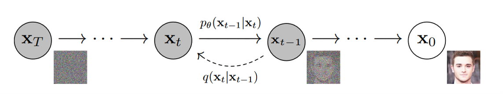
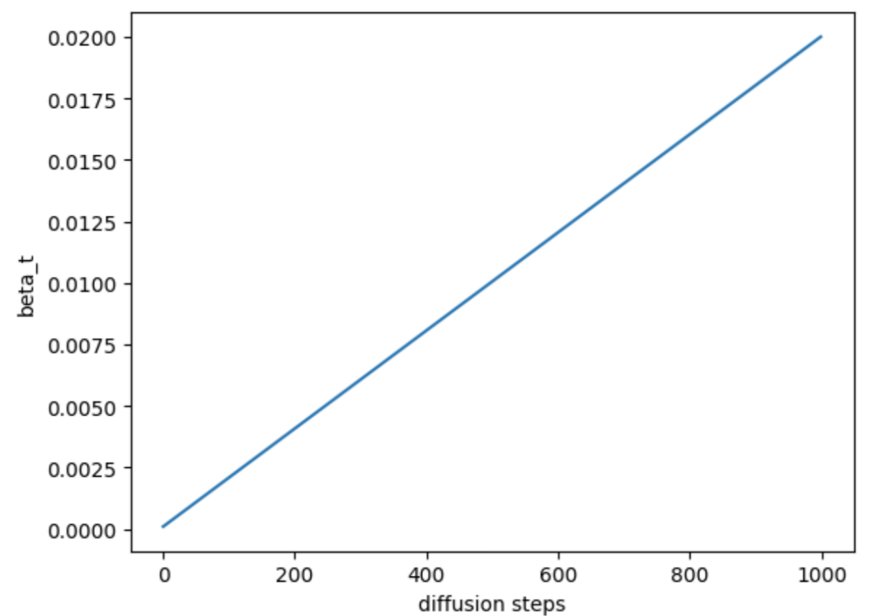
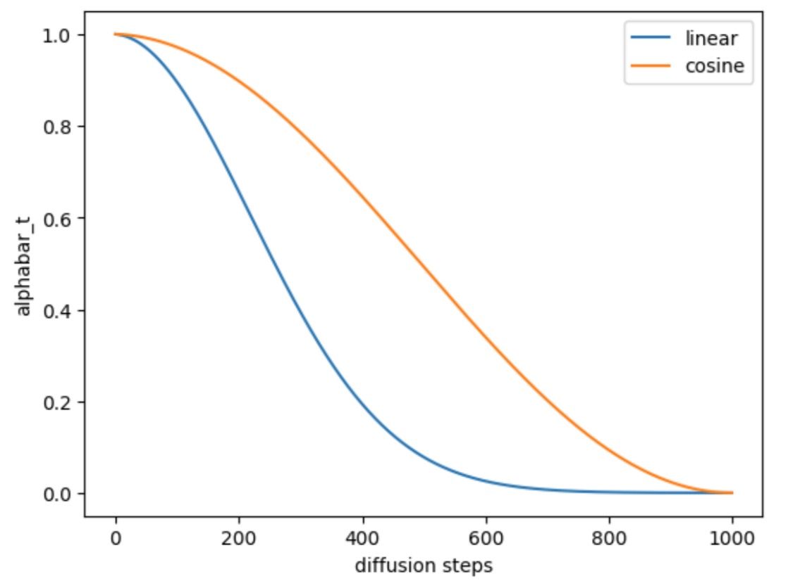

---
jupytext:
  cell_metadata_filter: -all
  formats: md:myst
  text_representation:
    extension: .md
    format_name: myst
    format_version: 0.13
    jupytext_version: 1.11.5
kernelspec:
  display_name: Python 3
  language: python
  name: python3
---

# Diffusion Model

## Background

Before we learn the diffusion model, we have to know some background knowledge in statistics. Perhaps you already have a good mastery of them, let's review them together. 

### Expectation

#### Definition

In probability theory, expectation (also called expected value, mean, average) is a generalization of the weighted average.

$E[X] = x_1 p_1 + x_2 p2 + ... +x_n p_n = \sum_{i=1}^n x_i p_1$

where $x_i$ and $p_i$ are i-th a possible outcome and its probability, respectively.

#### Properties

- $E[aX]=aE[X]$ where a is a constant value.
- $E[X+b]=E[X]+b$ where b is a constant value.
- $E[X+Y]=E[X]+E[Y]$.

### Variance

Variance is a measure of dispersion, meaning it is a measure of how far a set of numbers is spread out from their average value.

#### Definition

The variance of a random variable $X$ is the expected value of the squared deviation from the expectation of $X$.

#### Properties

- $Var[X]=E[X^2]−E[X]^2$.
- $Var[aX]=a^2 Var[X]$ where a is a constant value.
- $Var[X+b]=Var[X]$ where b is a constant value.
- $Var[X+Y]=Var[X]+Var[Y]$.

### Re-parameterization trick

When we sample data from a probability distribution, backpropagation the gradient is not possible because it is a stochastic process. To make it trainable, the re-parameterization trick is useful.

Let us assume that $z$ is sampled data from a gaussian distribution which the mean is $\mu$ and the variance is $\sigma^2$. Then, the mean and variance of $z$ would be $\mu$ and $\sigma^2$. Therefore, $z$ can be written as follows.

$z = N(\mu, \sigma^2 I) = \mu + \sigma \odot \epsilon$, where $\epsilon \thicksim N(0, I)$

where $\odot$ refers to element-wise product.

The mean and variance of $z$ correspond to $\mu$ and $\sigma^2$, respectively.

#### Mean (Expectation)

$E[z] = E[\mu+\sigma \odot \epsilon] = E[\mu] + \sigma E[\epsilon] = \mu$

The expectation of $\epsilon$ is 0 by definition.

#### Variance

$Var[z] = Var[\mu + \sigma \odot \epsilon] = Var[\sigma \odot \epsilon] = \sigma^2 Var[\epsilon] = \sigma^2$

The variance of \epsilon is 1 by definition.

### KL Divergence

In mathematical statistics, the Kullback–Leibler divergence (relative entropy), is a type of statistical distance.

#### Definition

1. Discrete probability distribution

$D_{KL}(P||Q) = \sum_{x \in X} P(x) log \frac{P(x)}{Q(x)}$,where $P$ and $Q$ are discrete probability distributions.

2. Continuous probability distribution

$D_{KL} (P||Q) = \int _{− \infty}^{\infty} p(x) log \frac{p(x)}{q(x)}dx$, where $p$ and $q$ denote the probability densities of $P$ and $Q$.

#### Jensen's inequality

In mathematics, Jensen's inequality relates the value of a convex (or concave) function of an integral to the integral of the function.

- Convex function: $f(E[X]) \leqq E[f(X)]$;
- Concave function: $f(E[X]) \geqq E[f(X)]$.

#### Properties of KL Divergence

- KL Divergence is always non-negative;
- The cross-entropy is always larger than the entropy;
- Two univariate normal distributions $P$ and $Q$ are simplified to $D_{KL}(P||Q) = log \frac{\sigma_q}{\sigma_p} + \frac{\sigma^2_p + (\mu_p − \mu_q)^2}{2\sigma^2_q} − \frac{1}{2}$.

### Evidence lower bound (ELBO)

In variational Bayesian methods, the evidence lower bound (often abbreviated ELBO) is a useful lower bound on the log-likelihood of some observed data.

#### Definition

$ELBO := E_{z∼q_{\phi}}[log \frac{pθ(x,z)}{q_{\phi}(z)}]$

where $p_{\theta}(x, z)$ is joint distribution of $x$ and $z$. $\theta$ and $\phi$ are parameters.

ELBO is used to obtain the lower bound of the evidence (or log evidence). The evidence is the likelihood function evaluated at a fixed $\theta$.

$evidence := log p_{\theta}(x)$

#### Properties

- The evidence is always larger than ELBO;
- KL Divergence between $p_{\theta}(z|x)$ and $q_{\phi}(z)$ equals $evidence−ELBO$.

### Forward and Reverse process

The diffusion models make data into a gaussian noise (latent vector) and restore it again. The former is called the forward process, and the latter is called the reverse process.

In the forward process, we add a gaussian noise to the data step by step (usually hundreds of steps). The transform of an individual step is defined as follows.

$x_t = q(x_t|x_{t−1}) = N(x_t, \sqrt{1−\beta_t}x_{t−1}, \beta_t I)$

In the reverse process, we restore image from a gaussian noise (a latent vector). If $\beta_t$ is small enough, the reverse $q(x_{t-1}|x_t)$ will also be gaussian. It is noteworthy that the reverse process is tractable when conditioned on $x_0$.

:::{figure-md} 01_structure


Forward and Backward process of diffusion model {cite}`denoising_diffusion`
:::

### Noise schedule

In diffusion models, the noise schedule define the methodology for iteratively adding noise to an image or for updating a sample based on model outputs. I'll introduce two type of schedules which are linear schedule and cosine schedule. The linear and cosine schedule were introduced by [Denoising Diffusion Probabilistic Models](https://arxiv.org/abs/2006.11239) and [Improved Denoising Diffusion Probabilistic Models](https://arxiv.org/abs/2006.11239), respectively.

#### Linear schedule

In the linear schedule, $\beta_t$ changes linearly.

:::{figure-md} 02_linear


Illustration of linear schedule
:::

#### Cosine schedule

Alex Nichol and Prafulla Dhariwal proposed the cosine schedule to prevent an image from turning into noise too quickly. They construct a different noise schedule in terms of $\overline{\alpha_t}$.

$\overline{\alpha_t} = \frac{f(t)}{f(0)}$, $f(t) = cos(\frac{\frac{t}{T} + s}{1+s} \frac{\pi}{2})^2$. By definition, the $\beta_t$ equals $1 - \frac{\overline{\alpha_t}}{\overline{\alpha_{t-1}}}$.

:::{figure-md} 03_cosine


Illustration of cosine schedule
:::

## Code

### Import Libraries

```{code-cell}
import tensorflow as tf### Tensorflow import from creating and training model
import numpy as np### Numpy import for math computations
import cv2### Opencv import for image processing
import time### time import for measuring training time
import matplotlib.pyplot as plt ### for plots
import matplotlib.animation as animation### for animations
from tensorflow.keras.models import Model### To define Tensorflow models
from tensorflow.keras.layers import Layer### To define Tensorflow layers
from tensorflow.keras.layers import (Reshape, Conv2DTranspose, Add, Conv2D, MaxPool2D, Dense,
                                     Flatten, Input, BatchNormalization, Input, MultiHeadAttention)### Different Tensorflow layers
from tensorflow.keras.optimizers import Adam### The Adam optimizer, which we'll be using for training our model
import tensorflow_addons as tfa### Used for working with Tensorflow addons
```

### Configuration

```{code-cell}
BATCH_SIZE = 32
TIME_STEPS = 1000
IM_SHAPE = (32,32,3)
N_HEADS = 8
ATTN_DIM = 256
N_GROUPS = 8
N_RESNETS = 2
LEARNING_RATE = 2e-4
EPOCHS = 10
FACTOR = 2
```

### Data Loading

```{note}
The dataset can be downloaded from [here](https://www.kaggle.com/datasets/jessicali9530/celeba-dataset).
```

```{code-cell}
ds_train = tf.keras.preprocessing.image_dataset_from_directory(
    "../assets/data/img_align_celeba", label_mode=None, image_size=(IM_SHAPE[0], IM_SHAPE[1]), batch_size=BATCH_SIZE
)
```

### Data Preprocessing

```{code-cell}
def preprocess(image):
    return tf.cast(image, tf.float32) / 127.5 - 1.0
```

### Data Augmentation

```{code-cell}
def augmentation(image):
    return tf.image.random_flip_left_right(image)
```

### Data

```{code-cell}
train_dataset = (
    ds_train
    .map(preprocess)
    .map(augmentation)
    .unbatch()
    .shuffle(buffer_size = 1024, reshuffle_each_iteration = True)
    .batch(BATCH_SIZE,drop_remainder=True)
    .prefetch(tf.data.AUTOTUNE)
)
```

### Linear schedule-beta

```{code-cell}
def linear_beta_schedule(timesteps):
    beta_start = 0.0001
    beta_end = 0.02
    ### tf.linspace(start,stop,num,...) method outputs **num** values from **start** to **stop**
    ### Check out the documentation @ https://www.tensorflow.org/api_docs/python/tf/linspace
    return tf.linspace(beta_start, beta_end, timesteps)


# define beta schedule
betas = linear_beta_schedule(TIME_STEPS)
print(betas)
```

### Define the alphas

```{code-cell}
alphas = 1. - betas
alphas_cumprod = tf.math.cumprod(alphas, axis=0)

### the cumprod method, is a cummulative product function.i.e. 
### if x = [1,2,3,4], then tf.math.cumprod(x) = [1,1*2,1*2*3,1*2*3*4]

# calculations for diffusion q(x_t | x_{t-1}) and others
sqrt_alphas_cumprod = tf.math.sqrt(alphas_cumprod)
sqrt_one_minus_alphas_cumprod = tf.math.sqrt(1. - alphas_cumprod)
```

### Getting a sample $(x_t)$

```{code-cell}
def extract(a, t, x_shape):
    b, *_ = t.shape
    out = tf.gather(a,t)
    output = tf.reshape(out, (b,*((1,) * (len(x_shape) - 1))))
    return output
    
def q_sample(x_start, t, noise):
    
    sqrt_alphas_cumprod_t = extract(sqrt_alphas_cumprod, t, x_start.shape)
    sqrt_one_minus_alphas_cumprod_t = extract(sqrt_one_minus_alphas_cumprod, t, x_start.shape)
    
    out_sample = sqrt_alphas_cumprod_t * x_start + sqrt_one_minus_alphas_cumprod_t * noise### x_start=x_0, noise = z
    return out_sample
```

### Modeling

```{code-cell}
class PositionalEmbeddings(tf.keras.layers.Layer):

    def __init__(self, dim):
        super().__init__()
        self.embedding_dim = dim

    def get_timestep_embedding(self, timesteps, embedding_dim: int):
        """
        From Fairseq.
        Build sinusoidal embeddings.
        This matches the implementation in tensor2tensor, but differs slightly
        from the description in Section 3.5 of "Attention Is All You Need".
        """
        half_dim = self.embedding_dim // 2
        emb = tf.math.log(10000.) / (half_dim - 1)
        emb = tf.exp(tf.range(half_dim, dtype=tf.float32) * -emb)
        emb = tf.cast(timesteps, dtype = tf.float32)[:, None] * emb[None, :]
        emb = tf.concat([tf.sin(emb), tf.cos(emb)], axis=1)
        if embedding_dim % 2 == 1:
            emb = tf.pad(emb, [[0, 0], [0, 1]])
        return emb

    def call(self, time):
        return self.get_timestep_embedding(time, self.embedding_dim)
def res_block(x,filters,n_groups,temb):
    previous = x
    x = Conv2D(filters, 3, padding="same",)(x) ### Convolution layer with padding same, so that the resolution remains the same
    
    ### temb represents the time embedding.
    ### It is passed into the silu activation function and a Dense Layer(Which can change the the embedding dimension )
    ### We also reshape the time embedding to match the output of 2d convnets.
    x += Dense(filters)(tf.nn.silu(temb))[:,None,None,:]
    
    ### Group Normalization is used.
    x = tf.nn.silu(tfa.layers.GroupNormalization(n_groups, axis = -1)(x))
    x = Conv2D(filters, 3, padding="same",)(x)

    # Project residual
    residual = Conv2D(filters, 1,padding="same",)(previous)
    x = tf.keras.layers.add([x, residual])  # Add back residual
    return x

def get_model(im_shape=(64,64,3),n_resnets=2,n_groups=8,attn_dim=32,n_heads=4,):
    input_1 = Input(shape=im_shape)### image input
    input_2 = Input(shape=())### time input
    t_dim = im_shape[0]*16

    # Entry block
    x = Conv2D(32, 3, padding="same")(input_1)
    temb = PositionalEmbeddings(t_dim)(input_2)### Create embeddings from the time input_2
    temb = Dense(t_dim)(tf.nn.gelu(Dense(t_dim)(temb)))### pass the embedding into the gelu activation function
    
    hs = [x]### variable used for storing each resolution level output, in the downward path, to be concatenated to the inputs of the upward path. 
    
    ### Downward Path
    for filters in [32, 64, 128, 256]:### for every resolution level (32,64,128,256), represent the depth they map to resolutions of (32,16,8,4)
        for _ in range(n_resnets):### we go through each resnet block per resolution level
            x = res_block(x,filters,n_groups,temb)### resblock
            ### if the resolution=16 (coinciding with a depth=64), we make the resnet output features attend to each other.
            ### Note how the attention axes = (1,2). This corresponds to the height and width dimensions.
            ### Feel free to Check the documentation out :) https://www.tensorflow.org/api_docs/python/tf/keras/layers/MultiHeadAttention.
            ### query = key = value = x. 
            ### We again use Group Normalization.
            if filters == 64:
                x = tfa.layers.GroupNormalization(groups=n_groups, axis = -1)(
                    MultiHeadAttention(num_heads=n_heads, key_dim=attn_dim, attention_axes=(1,2), )(query = x, value = x))
        hs.append(x)### append the output features to hs
        x = tf.keras.layers.MaxPooling2D(3, strides=2, padding="same")(x)### Downsampling in order to move to the next resolution level

    
    ### Bottleneck
    x = res_block(x,256,n_groups,temb)
    x = tfa.layers.GroupNormalization(groups=n_groups, axis = -1)(
      MultiHeadAttention(num_heads=n_heads, key_dim=attn_dim, attention_axes=(1,2), )(query = x, value = x))
    x = res_block(x,256,n_groups,temb)

    
    ### Upward path
    for filters in [256, 128, 64,32]:
        ### we resize x, to match with the shape of feature outputs (hs) in the downward path
        x = tf.image.resize_with_pad(x,hs[-1].shape[1],hs[-1].shape[2])
        x = tf.concat([x,hs.pop()], axis=-1)
    
        for _ in range(n_resnets):
            x = res_block(x,filters,n_groups,temb)

            if filters == 64:
                x = tfa.layers.GroupNormalization(groups=n_groups, axis = -1)(
                  MultiHeadAttention(num_heads=n_heads, key_dim=attn_dim, attention_axes=(1,2), )(query = x, value = x))

        if filters != 32:
            x = Conv2DTranspose(filters, 3, strides = (2,2),)(x)### Upsampling

    x = res_block(x,32,n_groups,temb)
    outputs = Conv2D(3, 3, padding="same", )(x)

    # Define the model
    model = Model([input_1,input_2], outputs,name='unet')
    return model

model= get_model(im_shape=IM_SHAPE,n_resnets=N_RESNETS,n_groups=N_GROUPS,attn_dim=ATTN_DIM,n_heads=N_HEADS,)
model.summary()
```

### Training

```{code-cell}
class LRSchedule(tf.keras.optimizers.schedules.LearningRateSchedule):

    def __init__(self, init_lr):
        self.init_lr = init_lr

    def __call__(self, step):
        return self.init_lr*(100000/(step+100000))

OPTIMIZER = Adam(learning_rate=LRSchedule(1e-4))

def custom_loss(denoise_model, x_start, t, noise=None):
    ### Our custom loss function takes in the predicted noise and compares (using the Huber Loss) it with the actual noise
    ### Huber Loss with a default value for delta as 1.0 Check out the documentation: https://www.tensorflow.org/api_docs/python/tf/keras/losses/Huber
    h = tf.keras.losses.Huber()
    noise = tf.random.normal(x_start.shape,mean=0,stddev=1)### noise=epsilon=z
    x_noisy = q_sample(x_start,t,noise)### x_t using the q_sample method
    predicted_noise = denoise_model([x_noisy, t])### model takes in the x_t and t and outputs noise
    return h(noise,predicted_noise)

### custom training block
### You can use tf.function to make graphs out of your programs. It is a transformation tool that creates Python-independent dataflow graphs 
### out of your Python code. This will help you create performant and portable models.
@tf.function
def training_block(x_batch):
    with tf.GradientTape() as recorder:
        ### for every element in the batch, we generate t randomly
        t = tf.random.uniform((BATCH_SIZE,),minval=0,maxval=TIME_STEPS,dtype=tf.int32)
        loss = custom_loss(model,x_batch,t)

    partial_derivatives = recorder.gradient(loss, model.trainable_weights)
    OPTIMIZER.apply_gradients(zip(partial_derivatives, model.trainable_weights))### gradient descent
    return loss
    
def neuralearn(EPOCHS):
    for epoch in range(EPOCHS):
        init_time = time.time()
        losses = []
        for step, x_batch in enumerate(train_dataset):
            loss = training_block(x_batch)
            losses.append(loss)
      
        print(str(epoch+1)+"/"+str(EPOCHS)+": Training Loss----->", sum(losses)/len(losses))
        print('Time Elapsed: ---> '+str(time.time()-init_time)+' s')
    
    print("Training Complete!!!!")

neuralearn(EPOCHS)
````

#### Testing

```{code-cell}
sqrt_recip_alphas = tf.math.sqrt(1.0 / alphas)
alphas_cumprod_prev = tf.concat([tf.ones((1,)),alphas_cumprod[:-1]],axis = 0)### alpha_t-1_bar = alphas_cumprod_prev

posterior_variance = betas * (1. - alphas_cumprod_prev) / (1. - alphas_cumprod)

def p_sample(model, x, t, t_index):
  
    betas_t = extract(betas, t, x.shape)### betas_t = 1-alphas_t
    sqrt_one_minus_alphas_cumprod_t = extract(sqrt_one_minus_alphas_cumprod, t, x.shape)### square root of 1-alpha_t_bar
    sqrt_recip_alphas_t = extract(sqrt_recip_alphas, t, x.shape)### 1/square root of alpha_t

    model_mean = sqrt_recip_alphas_t * (x - betas_t * model([x, t]) / sqrt_one_minus_alphas_cumprod_t)### equation 4 of algorithm 2 above

    if t_index == 0:
        return model_mean
    else:
        posterior_variance_t = extract(posterior_variance, t, x.shape)### sigma_t
        noise = tf.random.normal(x.shape)
        return model_mean + tf.math.sqrt(posterior_variance_t) * noise
        
imgs = []
img = tf.random.normal((64,IM_SHAPE[0],IM_SHAPE[1],IM_SHAPE[2]))
for i in reversed(range(0, TIME_STEPS)):### we go backwards from t = 1000 to t = 0
    print(i)
    img = p_sample(model,img,tf.fill((1,),i,), i)
    imgs.append(img)

plt.figure(figsize = (16,16))

for i in range(32):
    ax = plt.subplot(4,8, i+1)
    plt.imshow(np.array(imgs[999])[i])
    plt.axis("off")
```

#### GIF output

```{code-cell}
random_index = 0

fig = plt.figure()
ims = []
for i in range(TIME_STEPS):
    im = plt.imshow(np.array(imgs[i])[random_index], animated=True)
    ims.append([im])
    ims.append([im])

animate = animation.ArtistAnimation(fig, ims, interval=5, blit=True, repeat_delay=1000)
animate.save('diffusion.gif')
plt.show()
```

## Your turn! 🚀

 TBD.

## Acknowledgments

Thanks to [Kwangnam Yu](https://github.com/phykn) for creating the open-source project [diffusion_models_tutorial](https://github.com/phykn/diffusion_models_tutorial) and [kaggle](https://www.kaggle.com/) for creating the open-source course [Denoising Diffusion Models with TensorFlow](https://www.kaggle.com/code/folefac/denoising-diffusion-models-with-tensorflow#3.-The-Celeb-A-Dataset-%F0%9F%92%BE). They inspire the majority of the content in this chapter.

---

```{bibliography}
:filter: docname in docnames
```


