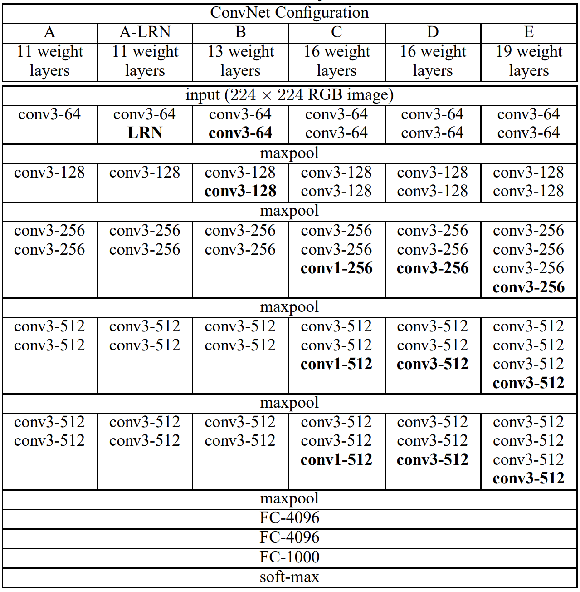
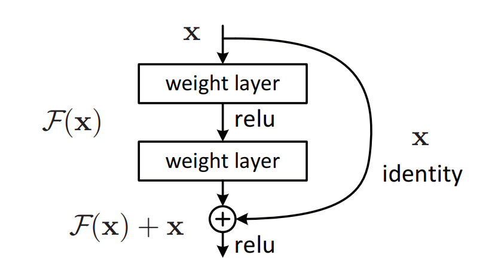
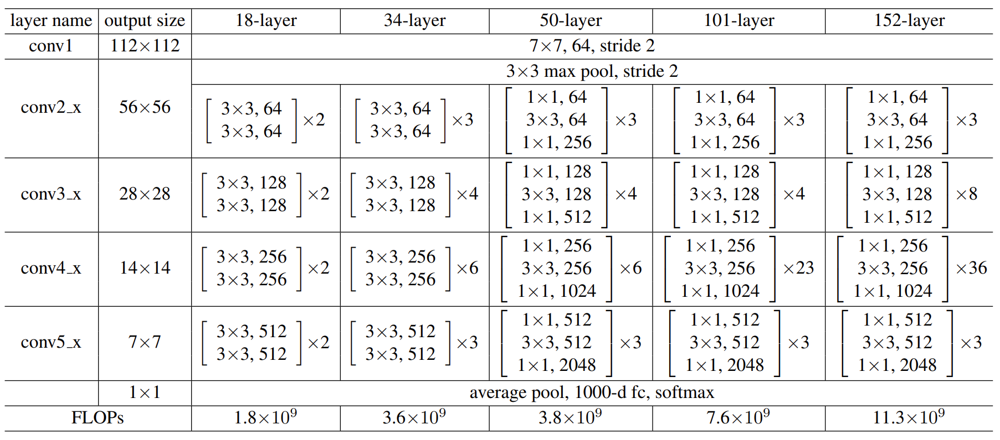
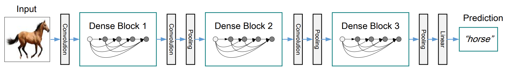
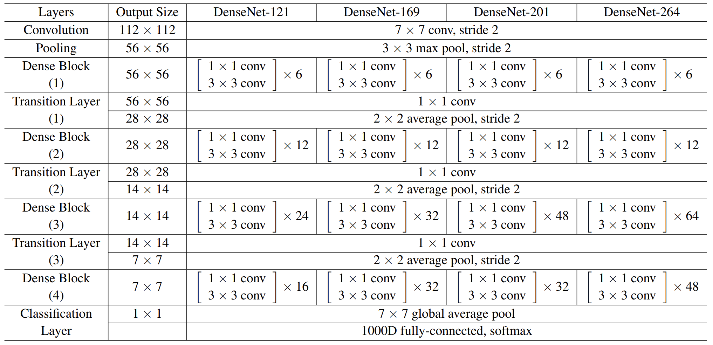
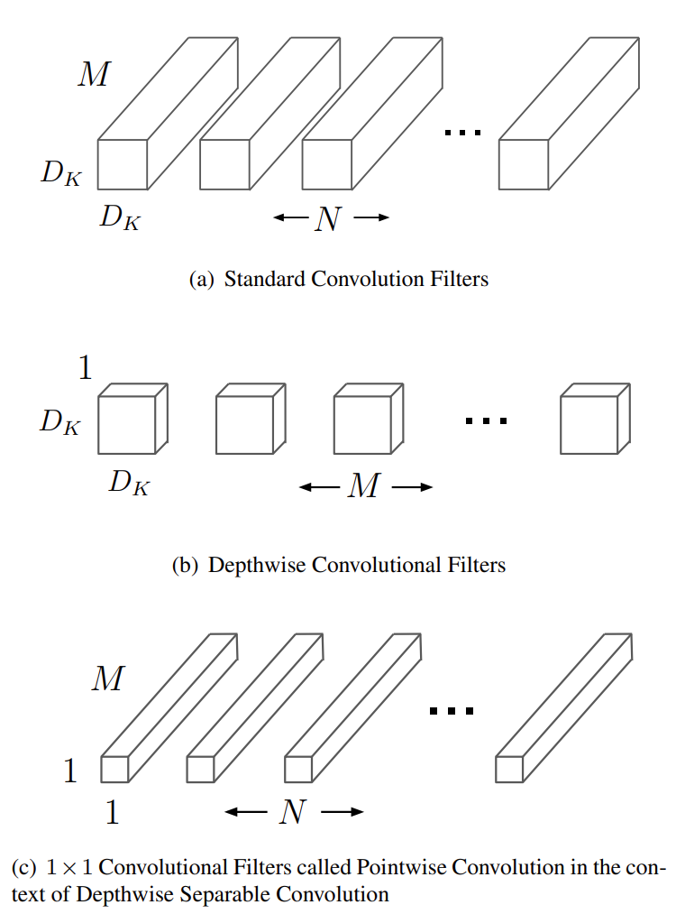
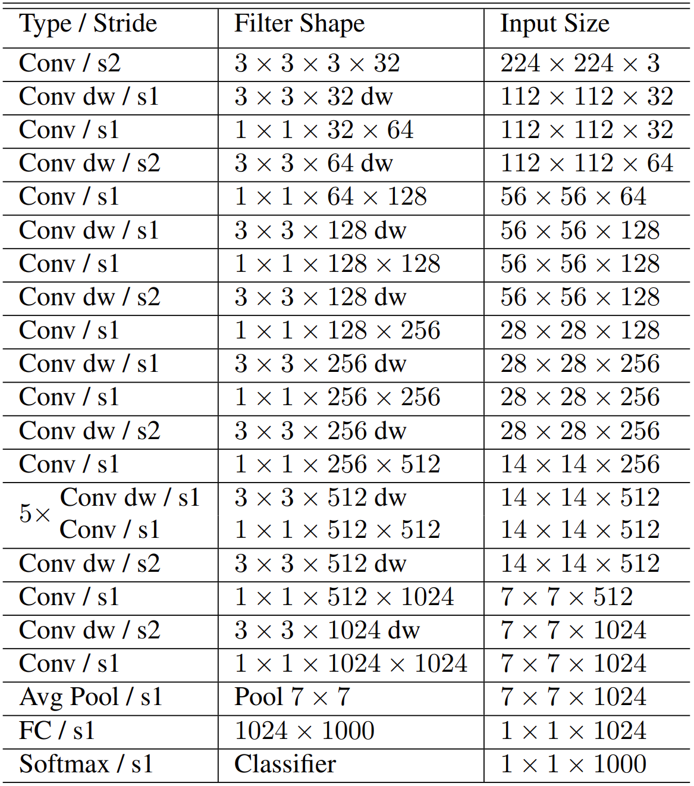

---
jupytext:
  cell_metadata_filter: -all
  formats: md:myst
  text_representation:
    extension: .md
    format_name: myst
    format_version: 0.13
    jupytext_version: 1.11.5
kernelspec:
  display_name: Python 3
  language: python
  name: python3
---

# Image classification

## What is image classification?

In this chapter we will introduce the image classification problem, which is the task of assigning an input image one label from a fixed set of categories. This is one of the core problems in Computer Vision that, despite its simplicity, has a large variety of practical applications.

Let me give you an example. In the image below an image classification model takes a single image and assigns probabilities to 4 labels, {cat, dog, hat, mug}. As shown in the image, keep in mind that to a computer an image is represented as one large 3-dimensional array of numbers. In this example, the cat image is 248 pixels wide, 400 pixels tall, and has three color channels Red,Green,Blue (or RGB for short). Therefore, the image consists of 248 x 400 x 3 numbers, or a total of 297,600 numbers. Each number is an integer that ranges from 0 (black) to 255 (white). Our task is to turn this quarter of a million numbers into a single label, such as “cat”.

:::{figure-md} 01_example_of_cls


Example of the image classification task
:::

The task in image classification is to predict a single label (or a distribution over labels as shown here to indicate our confidence) for a given image. Images are 3-dimensional arrays of integers from 0 to 255, of size Width x Height x 3. The 3 represents the three color channels Red, Green, Blue.

## Challenges

Since this task of recognizing a visual concept (e.g. cat) is relatively trivial for a human to perform, it is worth considering the challenges involved from the perspective of a Computer Vision algorithm. As we present (an inexhaustive) list of challenges below, keep in mind the raw representation of images as a 3-D array of brightness values:
- Viewpoint variation. A single instance of an object can be oriented in many ways with respect to the camera.
- Scale variation. Visual classes often exhibit variation in their size (size in the real world, not only in terms of their extent in the image).
- Deformation. Many objects of interest are not rigid bodies and can be deformed in extreme ways.
- Occlusion. The objects of interest can be occluded. Sometimes only a small portion of an object (as little as few pixels) could be visible.
- Illumination conditions. The effects of illumination are drastic on the pixel level.
- Background clutter. The objects of interest may blend into their environment, making them hard to identify.
- Intra-class variation. The classes of interest can often be relatively broad, such as chair. There are many different types of these objects, each with their own appearance.

A good image classification model must be invariant to the cross product of all these variations, while simultaneously retaining sensitivity to the inter-class variations.

## Pipeline of image classification

We’ve seen that the task in image classification is to take an array of pixels that represents a single image and assign a label to it. Our complete pipeline can be formalized as follows:
- Input: Our input consists of a set of N images, each labeled with one of K different classes. We refer to this data as the training set,
- Learning: Our task is to use the training set to learn what every one of the classes looks like. We refer to this step as training a classifier, or learning a model,
- Evaluation: In the end, we evaluate the quality of the classifier by asking it to predict labels for a new set of images that it has never seen before. We will then compare the true labels of these images to the ones predicted by the classifier. Intuitively, we’re hoping that a lot of the predictions match up with the true answers (which we call the ground truth).

## History & classic models

Since image classification is a classic task for computer vision, there are several models that are well-performed in the past. We can list them as follows: LeNet, AlexNet, VGGNet, GoogleNet, ResNet, DenseNet, SENet, MobileNet, ShuffleNet and ViT. In this part, we will introduce some of them.

### VGGNet

The VGG (Visual Geometry Group) multilayer network model has 19 more layers than AlexNet, verifying that increasing the depth in the network structure can directly affect the model performance. The design idea of VGG is to increase the depth of the network and use a small size convolutional kernel instead. As shown in the figure below, three 3×3 convolutional kernels are used to replace the 7×7 convolutional kernels in AlexNet, and two 3×3 convolutional kernels are used to replace the 5×5 convolutional kernels, which can increase the depth of the network and improve the model effect while ensuring the same perceptual field. The number of model parameters and operations can be reduced by using smaller 3×3 Filters, and the image feature information can be better retained. The specific advantages of the improvement are summarized as follows. 

- Using small 3×3 filters to replace large convolutional kernels.
- After replacing the convolution kernel, the convolution layers have the same perceptual field. 
- Each layer is trained by Re LU activation function and batch gradient descent after convolution operation.
- It is verified that increasing the network depth can improve the model performance Although, VGG has achieved good results in image classification and localization problems in 2014 due to its deeper network structure and low computational complexity, it uses 140 million parameters and is computationally intensive, which is its shortcoming.

:::{figure-md} 02_VGG_structure


Structure of VGGNet {cite}`VGG_structure`
:::

#### Code

```{code-cell}
import numpy as np
import tensorflow as tf
import tensorflow_addons as tfa
import tensorflow_datasets as tfds

AUTOTUNE = tf.data.experimental.AUTOTUNE


def conv_bn(out_channels, kernel_size, strides, padding, groups=1):
    return tf.keras.Sequential(
        [
            tf.keras.layers.ZeroPadding2D(padding=padding),
            tf.keras.layers.Conv2D(
                filters=out_channels,
                kernel_size=kernel_size,
                strides=strides,
                padding="valid",
                groups=groups,
                use_bias=False,
                name="conv",
            ),
            tf.keras.layers.BatchNormalization(name="bn"),
        ]
    )


class RepVGGBlock(tf.keras.layers.Layer):
    def __init__(
        self,
        in_channels,
        out_channels,
        kernel_size,
        strides=1,
        padding=1,
        dilation=1,
        groups=1,
        deploy=False,
    ):
        super(RepVGGBlock, self).__init__()
        self.deploy = deploy
        self.groups = groups
        self.in_channels = in_channels

        assert kernel_size == 3
        assert padding == 1

        padding_11 = padding - kernel_size // 2

        self.nonlinearity = tf.keras.layers.ReLU()

        if deploy:
            self.rbr_reparam = tf.keras.Sequential(
                [
                    tf.keras.layers.ZeroPadding2D(padding=padding),
                    tf.keras.layers.Conv2D(
                        filters=out_channels,
                        kernel_size=kernel_size,
                        strides=strides,
                        padding="valid",
                        dilation_rate=dilation,
                        groups=groups,
                        use_bias=True,
                    ),
                ]
            )
        else:
            self.rbr_identity = (
                tf.keras.layers.BatchNormalization()
                if out_channels == in_channels and strides == 1
                else None
            )
            self.rbr_dense = conv_bn(
                out_channels=out_channels,
                kernel_size=kernel_size,
                strides=strides,
                padding=padding,
                groups=groups,
            )
            self.rbr_1x1 = conv_bn(
                out_channels=out_channels,
                kernel_size=1,
                strides=strides,
                padding=padding_11,
                groups=groups,
            )
            print("RepVGG Block, identity = ", self.rbr_identity)

    def call(self, inputs):
        if hasattr(self, "rbr_reparam"):
            return self.nonlinearity(self.rbr_reparam(inputs))

        if self.rbr_identity is None:
            id_out = 0
        else:
            id_out = self.rbr_identity(inputs)

        return self.nonlinearity(
            self.rbr_dense(inputs) + self.rbr_1x1(inputs) + id_out
        )

    # This func derives the equivalent kernel and bias in a DIFFERENTIABLE way.
    # You can get the equivalent kernel and bias at any time and do whatever you want,
    #     for example, apply some penalties or constraints during training, just like you do to the other models.
    # May be useful for quantization or pruning.
    def get_equivalent_kernel_bias(self):
        kernel3x3, bias3x3 = self._fuse_bn_tensor(self.rbr_dense)
        kernel1x1, bias1x1 = self._fuse_bn_tensor(self.rbr_1x1)
        kernelid, biasid = self._fuse_bn_tensor(self.rbr_identity)
        return (
            kernel3x3 + self._pad_1x1_to_3x3_tensor(kernel1x1) + kernelid,
            bias3x3 + bias1x1 + biasid,
        )

    def _pad_1x1_to_3x3_tensor(self, kernel1x1):
        if kernel1x1 is None:
            return 0
        else:
            return tf.pad(
                kernel1x1, tf.constant([[1, 1], [1, 1], [0, 0], [0, 0]])
            )

    def _fuse_bn_tensor(self, branch):
        if branch is None:
            return 0, 0
        if isinstance(branch, tf.keras.Sequential):
            kernel = branch.get_layer("conv").weights[0]
            running_mean = branch.get_layer("bn").moving_mean
            running_var = branch.get_layer("bn").moving_variance
            gamma = branch.get_layer("bn").gamma
            beta = branch.get_layer("bn").beta
            eps = branch.get_layer("bn").epsilon
        else:
            assert isinstance(branch, tf.keras.layers.BatchNormalization)
            if not hasattr(self, "id_tensor"):
                input_dim = self.in_channels // self.groups
                kernel_value = np.zeros(
                    (3, 3, input_dim, self.in_channels), dtype=np.float32
                )
                for i in range(self.in_channels):
                    kernel_value[1, 1, i % input_dim, i] = 1
                self.id_tensor = tf.convert_to_tensor(
                    kernel_value, dtype=np.float32
                )
            kernel = self.id_tensor
            running_mean = branch.moving_mean
            running_var = branch.moving_variance
            gamma = branch.gamma
            beta = branch.beta
            eps = branch.epsilon
        std = tf.sqrt(running_var + eps)
        t = gamma / std
        return kernel * t, beta - running_mean * gamma / std

    def repvgg_convert(self):
        kernel, bias = self.get_equivalent_kernel_bias()
        return kernel, bias


class RepVGG(tf.keras.Model):
    def __init__(
        self,
        num_blocks,
        num_classes=1000,
        width_multiplier=None,
        override_groups_map=None,
        deploy=False,
    ):
        super(RepVGG, self).__init__()

        assert len(width_multiplier) == 4

        self.deploy = deploy
        self.override_groups_map = override_groups_map or dict()

        assert 0 not in self.override_groups_map

        self.in_planes = min(64, int(64 * width_multiplier[0]))

        self.stage0 = RepVGGBlock(
            in_channels=3,
            out_channels=self.in_planes,
            kernel_size=3,
            strides=2,
            padding=1,
            deploy=self.deploy,
        )
        self.cur_layer_idx = 1
        self.stage1 = self._make_stage(
            int(64 * width_multiplier[0]), num_blocks[0], stride=2
        )
        self.stage2 = self._make_stage(
            int(128 * width_multiplier[1]), num_blocks[1], stride=2
        )
        self.stage3 = self._make_stage(
            int(256 * width_multiplier[2]), num_blocks[2], stride=2
        )
        self.stage4 = self._make_stage(
            int(512 * width_multiplier[3]), num_blocks[3], stride=2
        )
        self.gap = tfa.layers.AdaptiveAveragePooling2D(output_size=1)
        self.linear = tf.keras.layers.Dense(num_classes)

    def _make_stage(self, planes, num_blocks, stride):
        strides = [stride] + [1] * (num_blocks - 1)
        blocks = []
        for stride in strides:
            cur_groups = self.override_groups_map.get(self.cur_layer_idx, 1)
            blocks.append(
                RepVGGBlock(
                    in_channels=self.in_planes,
                    out_channels=planes,
                    kernel_size=3,
                    strides=stride,
                    padding=1,
                    groups=cur_groups,
                    deploy=self.deploy,
                )
            )
            self.in_planes = planes
            self.cur_layer_idx += 1
        return tf.keras.Sequential(blocks)

    def call(self, x):
        out = self.stage0(x)
        out = self.stage1(out)
        out = self.stage2(out)
        out = self.stage3(out)
        out = self.stage4(out)
        out = self.gap(out)
        out = tf.keras.layers.Flatten()(out)
        out = self.linear(out)
        return out
```

### Resnet

ResNet (Residual Network) was proposed by Kaiming He and won the 2015 ILSVRC Grand Prix with an error rate of 3.57%. In the previous network, when the model is not deep enough, its network recognition is not strong, but when the network stack (Plain Network) is very deep, the network gradient disappearance and gradient dispersion are obvious, resulting in the model's computational effectiveness but not up but down. Therefore, in view of the degradation problem of this deep network, ResNet is designed as an ultra-deep network without the gradient vanishing problem.ResNet has various types depending on the number of layers, from 18 to 1202 layers. As an example, Res Net50 consists of 49 convolutional layers and 1 fully connected layer, as shown in the figure below. This simple addition does not add additional parameters and computation to the network, but can greatly increase the training speed and improve the training effect, and this simple structure can well solve the degradation problem when the model deepens the number of layers. In this way, the network will always be in the optimal state and the performance of the network will not decrease with increasing depth.

The most important part of ResNet should be the residual block, and here is the structure.

:::{figure-md} 03_residual_block


Structure of residual block {cite}`resblock_structure`
:::

:::{figure-md} 04_ResNet_structure


Structure of residual network {cite}`resnet_structure`
:::

#### Code

```{code-cell}
import time
import tensorflow as tf
import tensorflow.contrib as tf_contrib

weight_init = tf_contrib.layers.variance_scaling_initializer()
weight_regularizer = tf_contrib.layers.l2_regularizer(0.0001)

# Layer
def conv(x, channels, kernel=4, stride=2, padding='SAME', use_bias=True, scope='conv_0'):
    with tf.variable_scope(scope):
        x = tf.layers.conv2d(inputs=x, filters=channels,
                             kernel_size=kernel, kernel_initializer=weight_init,
                             kernel_regularizer=weight_regularizer,
                             strides=stride, use_bias=use_bias, padding=padding)

        return x

def fully_conneted(x, units, use_bias=True, scope='fully_0'):
    with tf.variable_scope(scope):
        x = flatten(x)
        x = tf.layers.dense(x, units=units, kernel_initializer=weight_init, kernel_regularizer=weight_regularizer, use_bias=use_bias)

        return x

def resblock(x_init, channels, is_training=True, use_bias=True, downsample=False, scope='resblock') :
    with tf.variable_scope(scope) :

        x = batch_norm(x_init, is_training, scope='batch_norm_0')
        x = relu(x)


        if downsample :
            x = conv(x, channels, kernel=3, stride=2, use_bias=use_bias, scope='conv_0')
            x_init = conv(x_init, channels, kernel=1, stride=2, use_bias=use_bias, scope='conv_init')

        else :
            x = conv(x, channels, kernel=3, stride=1, use_bias=use_bias, scope='conv_0')

        x = batch_norm(x, is_training, scope='batch_norm_1')
        x = relu(x)
        x = conv(x, channels, kernel=3, stride=1, use_bias=use_bias, scope='conv_1')


        return x + x_init

def bottle_resblock(x_init, channels, is_training=True, use_bias=True, downsample=False, scope='bottle_resblock') :
    with tf.variable_scope(scope) :
        x = batch_norm(x_init, is_training, scope='batch_norm_1x1_front')
        shortcut = relu(x)

        x = conv(shortcut, channels, kernel=1, stride=1, use_bias=use_bias, scope='conv_1x1_front')
        x = batch_norm(x, is_training, scope='batch_norm_3x3')
        x = relu(x)

        if downsample :
            x = conv(x, channels, kernel=3, stride=2, use_bias=use_bias, scope='conv_0')
            shortcut = conv(shortcut, channels*4, kernel=1, stride=2, use_bias=use_bias, scope='conv_init')

        else :
            x = conv(x, channels, kernel=3, stride=1, use_bias=use_bias, scope='conv_0')
            shortcut = conv(shortcut, channels * 4, kernel=1, stride=1, use_bias=use_bias, scope='conv_init')

        x = batch_norm(x, is_training, scope='batch_norm_1x1_back')
        x = relu(x)
        x = conv(x, channels*4, kernel=1, stride=1, use_bias=use_bias, scope='conv_1x1_back')

        return x + shortcut


def get_residual_layer(res_n) :
    x = []

    if res_n == 18 :
        x = [2, 2, 2, 2]

    if res_n == 34 :
        x = [3, 4, 6, 3]

    if res_n == 50 :
        x = [3, 4, 6, 3]

    if res_n == 101 :
        x = [3, 4, 23, 3]

    if res_n == 152 :
        x = [3, 8, 36, 3]

    return x

# Sampling
def flatten(x) :
    return tf.layers.flatten(x)

def global_avg_pooling(x):
    gap = tf.reduce_mean(x, axis=[1, 2], keepdims=True)
    return gap

def avg_pooling(x) :
    return tf.layers.average_pooling2d(x, pool_size=2, strides=2, padding='SAME')

# Activation function
def relu(x):
    return tf.nn.relu(x)

# Normalization function
def batch_norm(x, is_training=True, scope='batch_norm'):
    return tf_contrib.layers.batch_norm(x,
                                        decay=0.9, epsilon=1e-05,
                                        center=True, scale=True, updates_collections=None,
                                        is_training=is_training, scope=scope)
    
class ResNet(object):
    def __init__(self, sess, args):
        self.model_name = 'ResNet'
        self.sess = sess
        self.dataset_name = args.dataset

        if self.dataset_name == 'cifar10' :
            self.train_x, self.train_y, self.test_x, self.test_y = load_cifar10()
            self.img_size = 32
            self.c_dim = 3
            self.label_dim = 10

        self.checkpoint_dir = args.checkpoint_dir
        self.log_dir = args.log_dir

        self.res_n = args.res_n

        self.epoch = args.epoch
        self.batch_size = args.batch_size
        self.iteration = len(self.train_x) // self.batch_size

        self.init_lr = args.lr

    # Generator
    def network(self, x, is_training=True, reuse=False):
        with tf.variable_scope("network", reuse=reuse):

            if self.res_n < 50 :
                residual_block = resblock
            else :
                residual_block = bottle_resblock

            residual_list = get_residual_layer(self.res_n)

            ch = 32 # paper is 64
            x = conv(x, channels=ch, kernel=3, stride=1, scope='conv')

            for i in range(residual_list[0]) :
                x = residual_block(x, channels=ch, is_training=is_training, downsample=False, scope='resblock0_' + str(i))

            x = residual_block(x, channels=ch*2, is_training=is_training, downsample=True, scope='resblock1_0')

            for i in range(1, residual_list[1]) :
                x = residual_block(x, channels=ch*2, is_training=is_training, downsample=False, scope='resblock1_' + str(i))

            x = residual_block(x, channels=ch*4, is_training=is_training, downsample=True, scope='resblock2_0')

            for i in range(1, residual_list[2]) :
                x = residual_block(x, channels=ch*4, is_training=is_training, downsample=False, scope='resblock2_' + str(i))

            x = residual_block(x, channels=ch*8, is_training=is_training, downsample=True, scope='resblock_3_0')

            for i in range(1, residual_list[3]) :
                x = residual_block(x, channels=ch*8, is_training=is_training, downsample=False, scope='resblock_3_' + str(i))

            x = batch_norm(x, is_training, scope='batch_norm')
            x = relu(x)

            x = global_avg_pooling(x)
            x = fully_conneted(x, units=self.label_dim, scope='logit')

            return x

```

### DenseNet

DenseNet proposes a more radical dense connection mechanism than ResNet: i.e., connecting all layers to each other, specifically each layer accepts all the layers before it as its additional input. resNet short-circuits each layer with some previous layer (usually 2-3 layers), and the connection is made by element-level summation. In DenseNet, each layer is connected (concat) with all the preceding layers in the channel dimension and used as input to the next layer, which is a dense connection. Moreover, DenseNet is directly concat feature maps from different layers, which enables feature reuse and improves efficiency, and this feature is the most important difference between DenseNet and ResNet.

:::{figure-md} 05_dense_block


Structure of dense block {cite}`denseblock_structure`
:::

:::{figure-md} 06_DenseNet_structure


Structure of dense network {cite}`densenet_structure`
:::

#### Code

```{code-cell}
import tensorflow as tf
from tflearn.layers.conv import global_avg_pool
from tensorflow.examples.tutorials.mnist import input_data
from tensorflow.contrib.layers import batch_norm, flatten
from tensorflow.contrib.framework import arg_scope
import numpy as np

# Hyperparameter
nb_block = 2
dropout_rate = 0.2

def conv_layer(input, filter, kernel, stride=1, layer_name="conv"):
    with tf.name_scope(layer_name):
        network = tf.layers.conv2d(inputs=input, filters=filter, kernel_size=kernel, strides=stride, padding='SAME')
        return network

def Global_Average_Pooling(x, stride=1):
    """
    width = np.shape(x)[1]
    height = np.shape(x)[2]
    pool_size = [width, height]
    return tf.layers.average_pooling2d(inputs=x, pool_size=pool_size, strides=stride) # The stride value does not matter
    It is global average pooling without tflearn
    """

    return global_avg_pool(x, name='Global_avg_pooling')
    # But maybe you need to install h5py and curses or not


def Batch_Normalization(x, training, scope):
    with arg_scope([batch_norm],
                   scope=scope,
                   updates_collections=None,
                   decay=0.9,
                   center=True,
                   scale=True,
                   zero_debias_moving_mean=True) :
        return tf.cond(training,
                       lambda : batch_norm(inputs=x, is_training=training, reuse=None),
                       lambda : batch_norm(inputs=x, is_training=training, reuse=True))

def Drop_out(x, rate, training) :
    return tf.layers.dropout(inputs=x, rate=rate, training=training)

def Relu(x):
    return tf.nn.relu(x)

def Average_pooling(x, pool_size=[2,2], stride=2, padding='VALID'):
    return tf.layers.average_pooling2d(inputs=x, pool_size=pool_size, strides=stride, padding=padding)


def Max_Pooling(x, pool_size=[3,3], stride=2, padding='VALID'):
    return tf.layers.max_pooling2d(inputs=x, pool_size=pool_size, strides=stride, padding=padding)

def Concatenation(layers) :
    return tf.concat(layers, axis=3)

def Linear(x) :
    return tf.layers.dense(inputs=x, units=class_num, name='linear')

class DenseNet():
    def __init__(self, x, nb_blocks, filters, training):
        self.nb_blocks = nb_blocks
        self.filters = filters
        self.training = training
        self.model = self.Dense_net(x)

    def bottleneck_layer(self, x, scope):
        # print(x)
        with tf.name_scope(scope):
            x = Batch_Normalization(x, training=self.training, scope=scope+'_batch1')
            x = Relu(x)
            x = conv_layer(x, filter=4 * self.filters, kernel=[1,1], layer_name=scope+'_conv1')
            x = Drop_out(x, rate=dropout_rate, training=self.training)

            x = Batch_Normalization(x, training=self.training, scope=scope+'_batch2')
            x = Relu(x)
            x = conv_layer(x, filter=self.filters, kernel=[3,3], layer_name=scope+'_conv2')
            x = Drop_out(x, rate=dropout_rate, training=self.training)

            # print(x)

            return x

    def transition_layer(self, x, scope):
        with tf.name_scope(scope):
            x = Batch_Normalization(x, training=self.training, scope=scope+'_batch1')
            x = Relu(x)
            # x = conv_layer(x, filter=self.filters, kernel=[1,1], layer_name=scope+'_conv1')
            
            # https://github.com/taki0112/Densenet-Tensorflow/issues/10
            
            in_channel = x.shape[-1]
            x = conv_layer(x, filter=in_channel*0.5, kernel=[1,1], layer_name=scope+'_conv1')
            x = Drop_out(x, rate=dropout_rate, training=self.training)
            x = Average_pooling(x, pool_size=[2,2], stride=2)

            return x

    def dense_block(self, input_x, nb_layers, layer_name):
        with tf.name_scope(layer_name):
            layers_concat = list()
            layers_concat.append(input_x)

            x = self.bottleneck_layer(input_x, scope=layer_name + '_bottleN_' + str(0))

            layers_concat.append(x)

            for i in range(nb_layers - 1):
                x = Concatenation(layers_concat)
                x = self.bottleneck_layer(x, scope=layer_name + '_bottleN_' + str(i + 1))
                layers_concat.append(x)

            x = Concatenation(layers_concat)

            return x

    def Dense_net(self, input_x):
        x = conv_layer(input_x, filter=2 * self.filters, kernel=[7,7], stride=2, layer_name='conv0')
        x = Max_Pooling(x, pool_size=[3,3], stride=2)

        for i in range(self.nb_blocks) :
            # 6 -> 12 -> 48
            x = self.dense_block(input_x=x, nb_layers=4, layer_name='dense_'+str(i))
            x = self.transition_layer(x, scope='trans_'+str(i))

        """
        x = self.dense_block(input_x=x, nb_layers=6, layer_name='dense_1')
        x = self.transition_layer(x, scope='trans_1')
        x = self.dense_block(input_x=x, nb_layers=12, layer_name='dense_2')
        x = self.transition_layer(x, scope='trans_2')
        x = self.dense_block(input_x=x, nb_layers=48, layer_name='dense_3')
        x = self.transition_layer(x, scope='trans_3')
        """

        x = self.dense_block(input_x=x, nb_layers=32, layer_name='dense_final')

        # 100 Layer
        x = Batch_Normalization(x, training=self.training, scope='linear_batch')
        x = Relu(x)
        x = Global_Average_Pooling(x)
        x = flatten(x)
        x = Linear(x)

        # x = tf.reshape(x, [-1, 10])
        return x
```

### MobileNet

MobileNets are based on a streamlined architecture that uses depth-wise separable convolutions to build light weight deep neural networks. We introduce two simple global hyper-parameters that efficiently trade off between latency and accuracy. These hyper-parameters allow the model builder to choose the right sized model for their application based on the constraints of the problem.

Besides, the standard convolutional filters for normal CNNs are replaced by two layers: depthwise convolution and pointwise convolution to build a depthwise separable filter.

:::{figure-md} 07_MobileNet_convolution_structure


Replacement of standard convolution filter {cite}`mobileconv_structure`
:::

:::{figure-md} 07_MobileNet_body_structure


Body structure of MobileNet {cite}`mobilenet_structure`
:::

#### Code

```{code-cell}
import tensorflow as tf
import tensorflow.contrib.slim as slim


def mobilenet_v2_arg_scope(weight_decay, is_training=True, depth_multiplier=1.0, regularize_depthwise=False,
                           dropout_keep_prob=1.0):

    regularizer = tf.contrib.layers.l2_regularizer(weight_decay)
    if regularize_depthwise:
        depthwise_regularizer = regularizer
    else:
        depthwise_regularizer = None

    with slim.arg_scope([slim.conv2d, slim.separable_conv2d],
                        activation_fn=tf.nn.relu, normalizer_fn=slim.batch_norm,
                        normalizer_params={'is_training': is_training, 'center': True, 'scale': True }):

        with slim.arg_scope([slim.conv2d], weights_regularizer=regularizer):

            with slim.arg_scope([slim.separable_conv2d],
                                weights_regularizer=depthwise_regularizer, depth_multiplier=depth_multiplier):

                with slim.arg_scope([slim.dropout], is_training=is_training, keep_prob=dropout_keep_prob) as sc:

                    return sc


def block(net, input_filters, output_filters, expansion, stride):
    res_block = net
    res_block = slim.conv2d(inputs=res_block, num_outputs=input_filters * expansion, kernel_size=[1, 1])
    res_block = slim.separable_conv2d(inputs=res_block, num_outputs=None, kernel_size=[3, 3], stride=stride)
    res_block = slim.conv2d(inputs=res_block, num_outputs=output_filters, kernel_size=[1, 1], activation_fn=None)
    if stride == 2:
        return res_block
    else:
        if input_filters != output_filters:
            net = slim.conv2d(inputs=net, num_outputs=output_filters, kernel_size=[1, 1], activation_fn=None)
        return tf.add(res_block, net)


def blocks(net, expansion, output_filters, repeat, stride):
    input_filters = net.shape[3].value

    # first layer should take stride into account
    net = block(net, input_filters, output_filters, expansion, stride)

    for _ in range(1, repeat):
        net = block(net, input_filters, output_filters, expansion, 1)

    return net


def mobilenet_v2(inputs,
                 num_classes=1000,
                 dropout_keep_prob=0.999,
                 is_training=True,
                 depth_multiplier=1.0,
                 prediction_fn=tf.contrib.layers.softmax,
                 spatial_squeeze=True,
                 scope='MobilenetV2'):

    endpoints = dict()

    expansion = 6

    with tf.variable_scope(scope):

        with slim.arg_scope(mobilenet_v2_arg_scope(0.0004, is_training=is_training, depth_multiplier=depth_multiplier,
                                                   dropout_keep_prob=dropout_keep_prob)):
            net = tf.identity(inputs)

            net = slim.conv2d(net, 32, [3, 3], scope='conv11', stride=2)

            net = blocks(net=net, expansion=1, output_filters=16, repeat=1, stride=1)

            net = blocks(net=net, expansion=expansion, output_filters=24, repeat=2, stride=2)

            net = blocks(net=net, expansion=expansion, output_filters=32, repeat=3, stride=2)

            net = blocks(net=net, expansion=expansion, output_filters=64, repeat=4, stride=2)

            net = blocks(net=net, expansion=expansion, output_filters=96, repeat=3, stride=1)

            net = blocks(net=net, expansion=expansion, output_filters=160, repeat=3, stride=2)

            net = blocks(net=net, expansion=expansion, output_filters=320, repeat=1, stride=1)

            net = slim.conv2d(net, 1280, [1, 1], scope='last_bottleneck')

            net = slim.avg_pool2d(net, [7, 7])

            logits = slim.conv2d(net, num_classes, [1, 1], activation_fn=None, normalizer_fn=None, scope='features')

            if spatial_squeeze:
                logits = tf.squeeze(logits, [1, 2], name='SpatialSqueeze')

            endpoints['Logits'] = logits

            if prediction_fn:
                endpoints['Predictions'] = prediction_fn(logits, scope='Predictions')

    return logits, endpoints
```

### ViT

Different from the previous models, ViT (Vision Transformer) uses the concept of Transformer. Inspired by the Transformer scaling successes in NLP, they experiment with applying a standard Transformer directly to images, with the fewest possible modifications. To do so, they split an image into patches and provide the sequence of linear embeddings of these patches as an input to a Transformer. Image patches are treated the same way as tokens (words) in an NLP application. They train the model on image classification in supervised fashion.

#### Code

```{code-cell}
import tensorflow as tf
from tensorflow.keras import Model
from tensorflow.keras.layers import Layer
from tensorflow.keras import Sequential
import tensorflow.keras.layers as nn

from tensorflow import einsum
from einops import rearrange, repeat
from einops.layers.tensorflow import Rearrange

def pair(t):
    return t if isinstance(t, tuple) else (t, t)

class PreNorm(Layer):
    def __init__(self, fn):
        super(PreNorm, self).__init__()

        self.norm = nn.LayerNormalization()
        self.fn = fn

    def call(self, x, training=True):
        return self.fn(self.norm(x), training=training)

class MLP(Layer):
    def __init__(self, dim, hidden_dim, dropout=0.0):
        super(MLP, self).__init__()

        def GELU():
            def gelu(x, approximate=False):
                if approximate:
                    coeff = tf.cast(0.044715, x.dtype)
                    return 0.5 * x * (1.0 + tf.tanh(0.7978845608028654 * (x + coeff * tf.pow(x, 3))))
                else:
                    return 0.5 * x * (1.0 + tf.math.erf(x / tf.cast(1.4142135623730951, x.dtype)))

            return nn.Activation(gelu)

        self.net = Sequential([
            nn.Dense(units=hidden_dim),
            GELU(),
            nn.Dropout(rate=dropout),
            nn.Dense(units=dim),
            nn.Dropout(rate=dropout)
        ])

    def call(self, x, training=True):
        return self.net(x, training=training)

class Attention(Layer):
    def __init__(self, dim, heads=8, dim_head=64, dropout=0.0):
        super(Attention, self).__init__()
        inner_dim = dim_head * heads
        project_out = not (heads == 1 and dim_head == dim)

        self.heads = heads
        self.scale = dim_head ** -0.5

        self.attend = nn.Softmax()
        self.to_qkv = nn.Dense(units=inner_dim * 3, use_bias=False)

        if project_out:
            self.to_out = [
                nn.Dense(units=dim),
                nn.Dropout(rate=dropout)
            ]
        else:
            self.to_out = []

        self.to_out = Sequential(self.to_out)

    def call(self, x, training=True):
        qkv = self.to_qkv(x)
        qkv = tf.split(qkv, num_or_size_splits=3, axis=-1)
        q, k, v = map(lambda t: rearrange(t, 'b n (h d) -> b h n d', h=self.heads), qkv)

        # dots = tf.matmul(q, tf.transpose(k, perm=[0, 1, 3, 2])) * self.scale
        dots = einsum('b h i d, b h j d -> b h i j', q, k) * self.scale
        attn = self.attend(dots)

        # x = tf.matmul(attn, v)
        x = einsum('b h i j, b h j d -> b h i d', attn, v)
        x = rearrange(x, 'b h n d -> b n (h d)')
        x = self.to_out(x, training=training)

        return x

class Transformer(Layer):
    def __init__(self, dim, depth, heads, dim_head, mlp_dim, dropout=0.0):
        super(Transformer, self).__init__()

        self.layers = []

        for _ in range(depth):
            self.layers.append([
                PreNorm(Attention(dim, heads=heads, dim_head=dim_head, dropout=dropout)),
                PreNorm(MLP(dim, mlp_dim, dropout=dropout))
            ])

    def call(self, x, training=True):
        for attn, mlp in self.layers:
            x = attn(x, training=training) + x
            x = mlp(x, training=training) + x

        return x

class ViT(Model):
    def __init__(self, image_size, patch_size, num_classes, dim, depth, heads, mlp_dim,
                 pool='cls', dim_head=64, dropout=0.0, emb_dropout=0.0):
        """
            image_size: int.
            -> Image size. If you have rectangular images, make sure your image size is the maximum of the width and height
            patch_size: int.
            -> Number of patches. image_size must be divisible by patch_size.
            -> The number of patches is: n = (image_size // patch_size) ** 2 and n must be greater than 16.
            num_classes: int.
            -> Number of classes to classify.
            dim: int.
            -> Last dimension of output tensor after linear transformation nn.Linear(..., dim).
            depth: int.
            -> Number of Transformer blocks.
            heads: int.
            -> Number of heads in Multi-head Attention layer.
            mlp_dim: int.
            -> Dimension of the MLP (FeedForward) layer.
            dropout: float between [0, 1], default 0..
            -> Dropout rate.
            emb_dropout: float between [0, 1], default 0.
            -> Embedding dropout rate.
            pool: string, either cls token pooling or mean pooling
        """
        super(ViT, self).__init__()

        image_height, image_width = pair(image_size)
        patch_height, patch_width = pair(patch_size)

        assert image_height % patch_height == 0 and image_width % patch_width == 0, 'Image dimensions must be divisible by the patch size.'

        num_patches = (image_height // patch_height) * (image_width // patch_width)
        assert pool in {'cls', 'mean'}, 'pool type must be either cls (cls token) or mean (mean pooling)'

        self.patch_embedding = Sequential([
            Rearrange('b (h p1) (w p2) c -> b (h w) (p1 p2 c)', p1=patch_height, p2=patch_width),
            nn.Dense(units=dim)
        ], name='patch_embedding')

        self.pos_embedding = tf.Variable(initial_value=tf.random.normal([1, num_patches + 1, dim]))
        self.cls_token = tf.Variable(initial_value=tf.random.normal([1, 1, dim]))
        self.dropout = nn.Dropout(rate=emb_dropout)

        self.transformer = Transformer(dim, depth, heads, dim_head, mlp_dim, dropout)

        self.pool = pool

        self.mlp_head = Sequential([
            nn.LayerNormalization(),
            nn.Dense(units=num_classes)
        ], name='mlp_head')

    def call(self, img, training=True, **kwargs):
        x = self.patch_embedding(img)
        b, n, d = x.shape

        cls_tokens = repeat(self.cls_token, '() n d -> b n d', b=b)
        x = tf.concat([cls_tokens, x], axis=1)
        x += self.pos_embedding[:, :(n + 1)]
        x = self.dropout(x, training=training)

        x = self.transformer(x, training=training)

        if self.pool == 'mean':
            x = tf.reduce_mean(x, axis=1)
        else:
            x = x[:, 0]

        x = self.mlp_head(x)

        return x
```

## Classic datasets

As we said before, image classification task is mainly trained by datasets, so the importance of dataset is obvious. Here, we will introduce some widely-used datasets.

### CIFAR-10/100

The [CIFAR-10 dataset](http://www.cs.toronto.edu/~kriz/cifar.html) consists of 60000 32x32 colour images in 10 classes, with 6000 images per class. There are 50000 training images and 10000 test images. The dataset is divided into five training batches and one test batch, each with 10000 images. The test batch contains exactly 1000 randomly-selected images from each class. The training batches contain the remaining images in random order, but some training batches may contain more images from one class than another. Between them, the training batches contain exactly 5000 images from each class.

The CIFAR-100 dataset is just like the CIFAR-10, except it has 100 classes containing 600 images each. There are 500 training images and 100 testing images per class. The 100 classes in the CIFAR-100 are grouped into 20 superclasses. Each image comes with a "fine" label (the class to which it belongs) and a "coarse" label (the superclass to which it belongs).

```{note}
Download for Linux
wget http://www.cs.toronto.edu/~kriz/cifar-10-python.tar.gz
wget http://www.cs.toronto.edu/~kriz/cifar-100-python.tar.gz

Download for Win/Mac
Download from the offical website
```

### ImageNet-1000

[ImageNet](https://image-net.org/) is an image dataset organized according to the WordNet hierarchy. Each meaningful concept in WordNet, possibly described by multiple words or word phrases, is called a "synonym set" or "synset". There are more than 100,000 synsets in WordNet; the majority of them are nouns (80,000+). In ImageNet, we aim to provide on average 1000 images to illustrate each synset. Images of each concept are quality-controlled and human-annotated. In its completion, we hope ImageNet will offer tens of millions of cleanly labeled and sorted images for most of the concepts in the WordNet hierarchy.

```{note}
If you want to download this dataset, please visit [kaggle](https://www.kaggle.com/c/imagenet-object-localization-challenge/overview/description) for more information.
```

## Standards

### Top-1 accuracy

If your predicted label takes the largest one inside the final probability vector as the prediction result, and if the one with the highest probability in your prediction result is correctly classified, then the prediction is correct. Otherwise, the prediction is wrong.

### Top-5 accuracy

Among the 50 classification probabilities of the test image, take the first 5 maximum classification probabilities, whether the correct label (classification) is in it or not, that is, whether it is one of these first 5, if it is, it is a successful classification.

## Your turn! 🚀

TBD.

## Acknowledgments

Thanks to [Stanford](https://www.stanford.edu) for creating the open-source course [CS231n: Deep Learning for Computer Vision](https://cs231n.github.io/classification/), [Duc Thang HOANG](https://github.com/hoangthang1607) for creating the open-source project [RepVGG-Tensorflow-2](https://github.com/hoangthang1607/RepVGG-Tensorflow-2), [Junho Kim](https://github.com/taki0112) for creating the open-source project [ResNet-Tensorflow](https://github.com/taki0112/ResNet-Tensorflow), [Densenet-Tensorflow](https://github.com/taki0112/Densenet-Tensorflow) and [vit-tensorflow](https://github.com/taki0112/vit-tensorflow) and [ohadlights](https://github.com/ohadlights) for creating the open-source project [mobilenetv2](https://github.com/ohadlights/mobilenetv2). They inspire the majority of the content in this chapter.

---

```{bibliography}
:filter: docname in docnames
```


