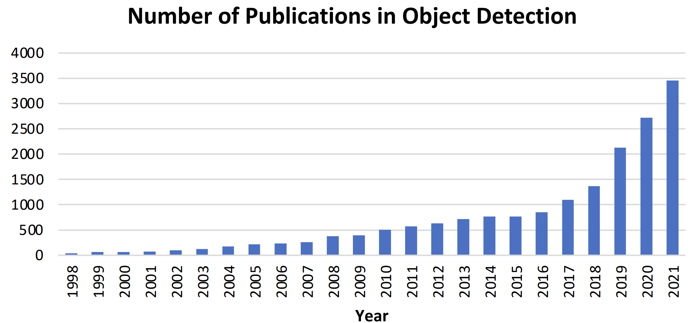
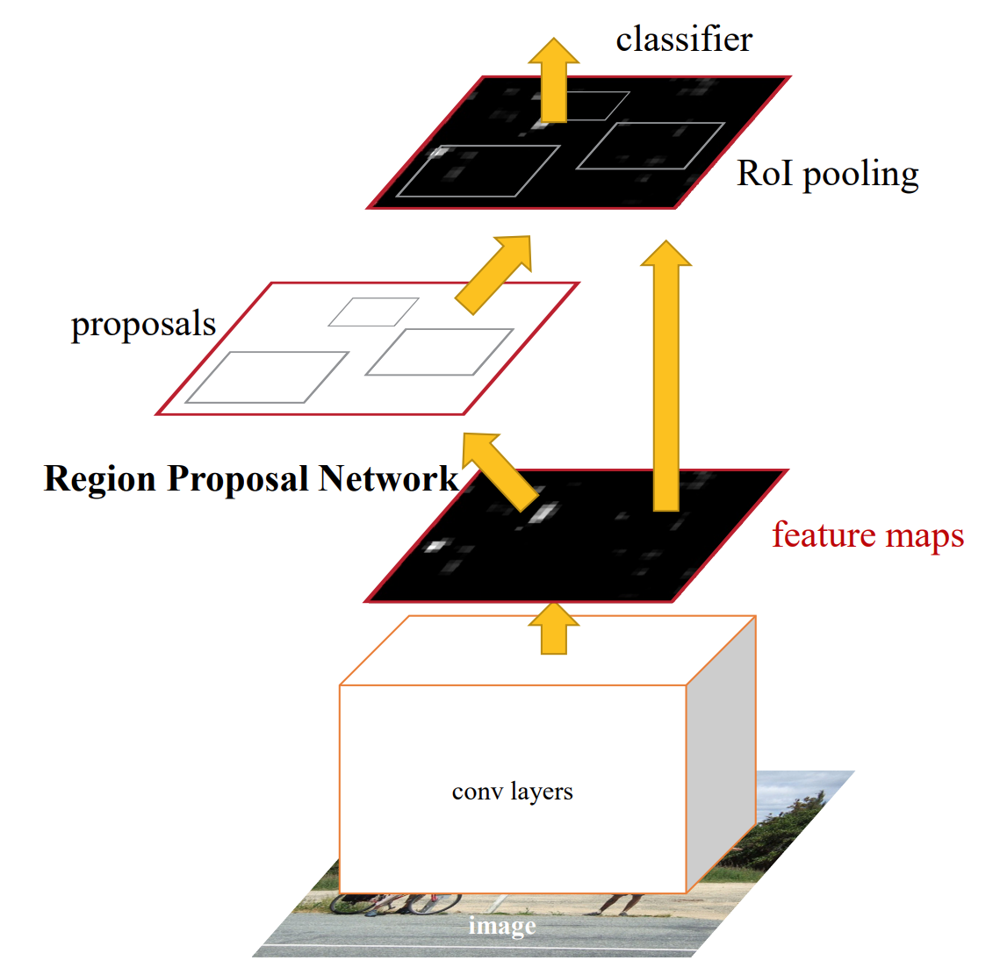
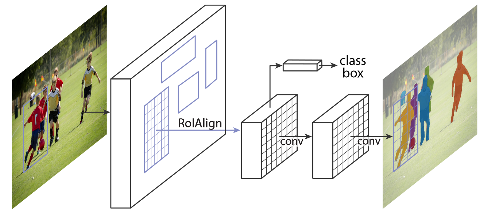
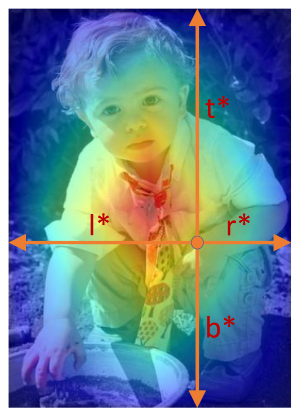

---
jupytext:
  cell_metadata_filter: -all
  formats: md:myst
  text_representation:
    extension: .md
    format_name: myst
    format_version: 0.13
    jupytext_version: 1.11.5
kernelspec:
  display_name: Python 3
  language: python
  name: python3
---

# Object detection

## What is object detection?

In this chapter we will introduce the object detection problem which can be described in this way: given an image or a video stream, an object detection model can identify which of a known set of objects might be present and provide information about their positions within the image.

For example, this screenshot of the example application shows how three objects have been recognized and their positions annotated:

:::{figure-md} 01_example


Example of the object detection task
:::

Object detection has now been widely used in many real-world applications, such as autonomous driving, robot vision, video surveillance, etc. The following image shows the growing number of publications that are associated with “object detection” over the past two decades.

:::{figure-md} 02_number_of_pu


The increasing number of publications in object detection from 1998 to 2021
:::


## Challenges

In addition to some common challenges in other computer vision tasks such as objects under different viewpoints, illuminations,and intra-class variations, the challenges in object detection include but are not limited to the following aspects: 

- object rotation and scale changes (e.g., small objects);
- accurate object localization;
- dense and occluded object detection;
- speed up of detection, etc.

## History & classic models

Since image classification is a classic task for computer vision, there are several models that are well-performed in the past. We can list them as follows: Faster R-CNN, Mask R-CNN, YOLO, FCOS, DETR. In this part, we will introduce them in order.

### Faster R-CNN

Faster R-CNN is a single, unified network for object detection that utilizes a region proposal network (RPN) with the CNN model2. The RPN shares full-image convolutional features with the detection network, enabling nearly cost-free region proposals2. It is a fully convolutional network that simultaneously predicts object bounds and objectness scores at each position.

:::{figure-md} 03_faster_rcnn


The structure of Faster RCNN {cite}`faster_structure`
:::

```{note}
We can see the paper [here](https://arxiv.org/pdf/1506.01497.pdf).
```

#### Code

Due to the complexity, here we just introduce the key parts of the model, Region Proposal Network(RPN).

```{code-cell}
import tensorflow as tf
import numpy as np

def rpn_head(featuremap, channel, num_anchors):
    """
    Returns:
        label_logits: fHxfWxNA
        box_logits: fHxfWxNAx4
    """
    with argscope(Conv2D, data_format='channels_first',
                  kernel_initializer=tf.random_normal_initializer(stddev=0.01)):
        hidden = Conv2D('conv0', featuremap, channel, 3, activation=tf.nn.relu)

        label_logits = Conv2D('class', hidden, num_anchors, 1)
        box_logits = Conv2D('box', hidden, 4 * num_anchors, 1)
        # 1, NA(*4), im/16, im/16 (NCHW)

        label_logits = tf.transpose(label_logits, [0, 2, 3, 1])  # 1xfHxfWxNA
        label_logits = tf.squeeze(label_logits, 0)  # fHxfWxNA

        shp = tf.shape(box_logits)  # 1x(NAx4)xfHxfW
        box_logits = tf.transpose(box_logits, [0, 2, 3, 1])  # 1xfHxfWx(NAx4)
        box_logits = tf.reshape(box_logits, tf.stack([shp[2], shp[3], num_anchors, 4]))  # fHxfWxNAx4
    return label_logits, box_logits
```

```{seealso}
The complete version of Faster R-CNN can be found [here](https://github.com/tensorpack/tensorpack/tree/master/examples/FasterRCNN).
```

### Mask R-CNN

Mask R-CNN is a deep neural network aimed to solve both object detection and instance segmentation problems. In other words, it can separate different objects in an image. You give it an image, it gives you the object bounding boxes, classes and masks. Mask R-CNN was developed on top of Faster R-CNN, a Region-Based Convolutional Neural Network. It is simple to train and adds only a small overhead to Faster R-CNN, running at 5 fps.

:::{figure-md} 04_mask_rcnn


The structure of Mask RCNN {cite}`mask_structure`
:::

```{note}
We can see the paper [here](https://arxiv.org/pdf/1703.06870v3.pdf).
```

#### Code

The key parts in Mask RCNN are:

- RoIAlign

```{code-cell}
import tensorflow as tf

def crop_and_resize(image, boxes, box_ind, crop_size, pad_border=True):
    """
    Aligned version of tf.image.crop_and_resize, following our definition of floating point boxes.

    Args:
        image: NCHW
        boxes: nx4, x1y1x2y2
        box_ind: (n,)
        crop_size (int):
    Returns:
        n,C,size,size
    """
    assert isinstance(crop_size, int), crop_size
    boxes = tf.stop_gradient(boxes)

    # TF's crop_and_resize produces zeros on border
    if pad_border:
        # this can be quite slow
        image = tf.pad(image, [[0, 0], [0, 0], [1, 1], [1, 1]], mode='SYMMETRIC')
        boxes = boxes + 1

    @under_name_scope()
    def transform_fpcoor_for_tf(boxes, image_shape, crop_shape):
        """
        The way tf.image.crop_and_resize works (with normalized box):
        Initial point (the value of output[0]): x0_box * (W_img - 1)
        Spacing: w_box * (W_img - 1) / (W_crop - 1)
        Use the above grid to bilinear sample.

        However, what we want is (with fpcoor box):
        Spacing: w_box / W_crop
        Initial point: x0_box + spacing/2 - 0.5
        (-0.5 because bilinear sample (in my definition) assumes floating point coordinate
         (0.0, 0.0) is the same as pixel value (0, 0))

        This function transform fpcoor boxes to a format to be used by tf.image.crop_and_resize

        Returns:
            y1x1y2x2
        """
        x0, y0, x1, y1 = tf.split(boxes, 4, axis=1)

        spacing_w = (x1 - x0) / tf.cast(crop_shape[1], tf.float32)
        spacing_h = (y1 - y0) / tf.cast(crop_shape[0], tf.float32)

        imshape = [tf.cast(image_shape[0] - 1, tf.float32), tf.cast(image_shape[1] - 1, tf.float32)]
        nx0 = (x0 + spacing_w / 2 - 0.5) / imshape[1]
        ny0 = (y0 + spacing_h / 2 - 0.5) / imshape[0]

        nw = spacing_w * tf.cast(crop_shape[1] - 1, tf.float32) / imshape[1]
        nh = spacing_h * tf.cast(crop_shape[0] - 1, tf.float32) / imshape[0]

        return tf.concat([ny0, nx0, ny0 + nh, nx0 + nw], axis=1)

    image_shape = tf.shape(image)[2:]

    boxes = transform_fpcoor_for_tf(boxes, image_shape, [crop_size, crop_size])
    image = tf.transpose(image, [0, 2, 3, 1])   # nhwc
    ret = tf.image.crop_and_resize(
        image, boxes, tf.cast(box_ind, tf.int32),
        crop_size=[crop_size, crop_size])
    ret = tf.transpose(ret, [0, 3, 1, 2])   # ncss
    return ret


def roi_align(featuremap, boxes, resolution):
    """
    Args:
        featuremap: 1xCxHxW
        boxes: Nx4 floatbox
        resolution: output spatial resolution

    Returns:
        NxCx res x res
    """
    # sample 4 locations per roi bin
    ret = crop_and_resize(
        featuremap, boxes,
        tf.zeros(tf.shape(boxes)[0], dtype=tf.int32),
        resolution * 2)
    try:
        avgpool = tf.nn.avg_pool2d
    except AttributeError:
        avgpool = tf.nn.avg_pool
    ret = avgpool(ret, [1, 1, 2, 2], [1, 1, 2, 2], padding='SAME', data_format='NCHW')
    return ret
```

- Mask

```{code-cell}
import tensorflow as tf

def maskrcnn_upXconv_head(feature, num_category, num_convs, norm=None):
    """
    Args:
        feature (NxCx s x s): size is 7 in C4 models and 14 in FPN models.
        num_category(int):
        num_convs (int): number of convolution layers
        norm (str or None): either None or 'GN'

    Returns:
        mask_logits (N x num_category x 2s x 2s):
    """
    assert norm in [None, 'GN'], norm
    l = feature
    with argscope([Conv2D, Conv2DTranspose], data_format='channels_first',
                  kernel_initializer=tfv1.variance_scaling_initializer(
                      scale=2.0, mode='fan_out',
                      distribution='untruncated_normal')):
        # c2's MSRAFill is fan_out
        for k in range(num_convs):
            l = Conv2D('fcn{}'.format(k), l, cfg.MRCNN.HEAD_DIM, 3, activation=tf.nn.relu)
            if norm is not None:
                l = GroupNorm('gn{}'.format(k), l)
        l = Conv2DTranspose('deconv', l, cfg.MRCNN.HEAD_DIM, 2, strides=2, activation=tf.nn.relu)
        l = Conv2D('conv', l, num_category, 1, kernel_initializer=tf.random_normal_initializer(stddev=0.001))
    return l
```

### FCOS

FCOS (Fully Convolutional One-Stage Object Detection) is a one-stage object detection algorithm that uses a fully convolutional architecture to detect objects. It is a simple and effective method for object detection that does not require region proposal networks (RPNs) or anchor boxes.

<!---
:::{figure-md} 05_fcos


The structure of FCOS {cite}`fcos_structure`
:::

--->

```{note}
We can see the paper [here](https://arxiv.org/pdf/1904.01355v5.pdf).
```

#### Code

The key point in FCOS is Center-ness, which is a novel way to calculate target: $centerness = \sqrt{\frac{min(l,r)}{max(l,r)} \frac{min(t,b)}{max(t,b)}}$

:::{figure-md} 06_centerness


Illustration of centerness {cite}`fcos_structure`
:::

```{code-cell}
import tensorflow as tf

class CenternessNet(tf.keras.layers.Layer):
    def __init__(self, n_anchor, use_bias = None, concat = False, convolution = conf_conv, normalize = None, activation = tf.keras.activations.sigmoid, **kwargs):
        super(CenternessNet, self).__init__(**kwargs)
        self.n_anchor = n_anchor
        self.use_bias = (normalize is None) if use_bias is None else use_bias
        self.concat = concat
        self.activation = activation
        self.convolution = convolution
        self.normalize = normalize

    def build(self, input_shape):
        if not isinstance(input_shape, (tuple, list)):
            input_shape = [input_shape]
        
        self.layers = [self.convolution(self.n_anchor, 3, padding = "same", use_bias = self.use_bias, name = "head")]
        if self.normalize is not None:
            self.layers.append(self.normalize(name = "norm"))
        self.layers.append(tf.keras.layers.Reshape([-1, 1], name = "reshape"))
        if self.concat and 1 < len(input_shape):
            self.post = tf.keras.layers.Concatenate(axis = -2, name = "logits_concat")
        self.act = tf.keras.layers.Activation(self.activation, dtype = tf.float32, name = "logits")

    def call(self, inputs):
        if not isinstance(inputs, (tuple, list)):
            inputs = [inputs]
        out = []
        for x in inputs:
            for l in self.layers:
                x = l(x)
            out.append(x)
        if len(out) == 1:
            out = out[0]
        elif self.concat:
            out = self.post(out)
        if isinstance(out, (tuple, list)):
            out = [self.act(o) for o in out]
        else:
            out = self.act(out)
        return out
```

### DETR

Similar to image classification, Transformer is also used in object detection task, and the classical one is DEtection TRansformer(DETR).

<!---
:::{figure-md} 07_DETR


Structure of DETR {cite}`detr_structure`
:::
--->

```{note}
We can see the paper [here](https://arxiv.org/pdf/2005.12872v3.pdf).
```

#### Code

```{code-cell}
import tensorflow as tf
from tensorflow.keras.layers import Dense
from tensorflow.keras.layers import Conv2D
from tensorflow.keras.layers import Embedding

class DETR(tf.keras.Model):
    """ This is the DETR module that performs object detection """
    def __init__(self, 
                 backbone:      tf.keras.Model, 
                 transformer:   tf.keras.Model, 
                 num_classes:   int, 
                 num_queries:   int, 
                 aux_loss:      bool = False, 
                 **kwargs):
                 
        super(DETR, self).__init__(**kwargs)
        self.num_queries = num_queries
        self.transformer = transformer
        hidden_dim = transformer.d_model
        self.class_embed = Dense(num_classes+1, name='class_embed')
        self.bbox_embed = MLP(hidden_dim, 4, 3, name='bbox_embed')
        self.query_embed = Embedding(num_queries, hidden_dim, name='query_embed')
        self.query_embed.build((num_queries, hidden_dim))
        self.input_proj = Conv2D(hidden_dim, 1, name='input_proj')
        self.backbone = backbone
        self.aux_loss = aux_loss

    def call(self, samples: Dict):
        features, pos = self.backbone(samples)
        src, mask = features[-1][1]['img'], features[-1][1]['mask']
        assert mask is not None
        hs = self.transformer(self.input_proj(src), mask, self.query_embed.weights[0], pos[-1][1])
```

```{seealso}
The complete version of DETR can be found [here](https://github.com/PaperCodeReview/DETR-TF).
```

## Your turn! 🚀

TBD.

## Acknowledgments

Thanks to [Tensorpack](https://github.com/tensorpack) for creating the open-source project [tensorpack](https://github.com/tensorpack/tensorpack), [Hyungjin Kim](https://github.com/Burf) for creating the open-source project [TFDetection](https://github.com/Burf/TFDetection) and [PaperCodeReview](https://github.com/PaperCodeReview) for creating the open-source project [DETR-TF](https://github.com/PaperCodeReview/DETR-TF). They inspire the majority of the content in this chapter.

---

```{bibliography}
:filter: docname in docnames
```


