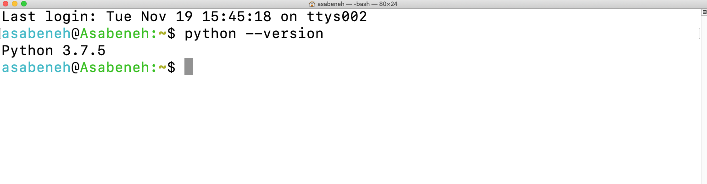
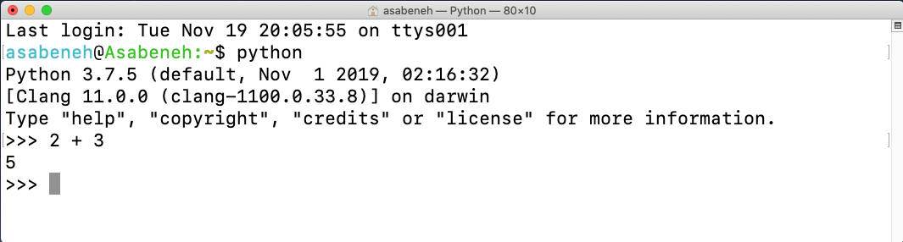
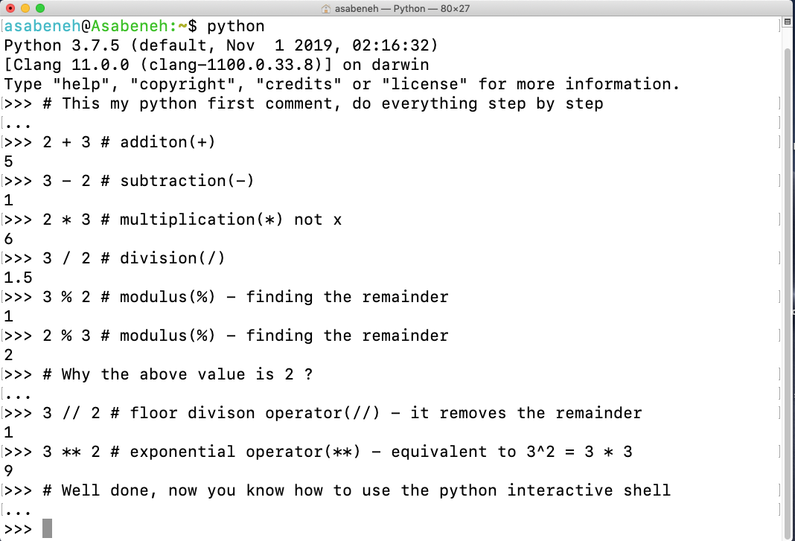
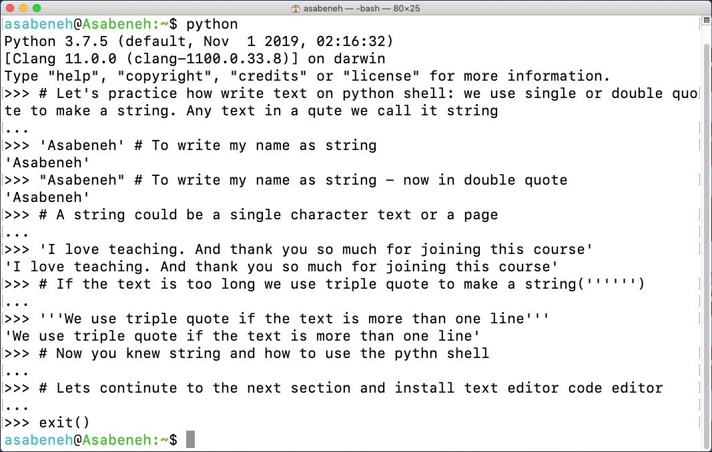

---
jupytext:
 cell_metadata_filter: -all
 formats: md:myst
 text_representation:
  extension: .md
  format_name: myst
  format_version: 0.13
  jupytext_version: 1.11.5
kernelspec:
 display_name: Python 3
 language: Python
 name: Python3
---

# Python programming introduction

Python is a high-level programming language for general-purpose programming. It is an open-source, interpreted, objected-oriented programming language. Python was created by a Dutch programmer, Guido van Rossum. The name of the Python programming language was derived from a British sketch comedy series, Month Python's Flying Circus. The first version was released on February 20, 1991.

Python is an easy-to-learn, powerful programming language. It has efficient high-level data structures and a simple but effective approach to object-oriented programming. Python’s elegant syntax and dynamic typing, together with its interpreted nature, make it an ideal language for scripting and rapid application development in many areas on most platforms.

It is used for:

- web development (server-side),
- software development,
- mathematics,
- system scripting.

These Python programming-related sections are designed for beginners and professionals who want to learn Python programming language. If you are in favor of videos, you may get started with this [Python for Absolute Beginners video](https://www.youtube.com/watch?v=11OYpBrhdyM).

## Why Python?

It is a programming language that is very close to human language and because of that, it is easy to learn and use. Python is used by various industries and companies (including Google). It has been used to develop web applications, desktop applications, system administration, and Machine Learning libraries. Python is a highly embraced language in the data science and Machine Learning community. Hope this is enough to convince you to start learning Python. Python is eating the world and you are killing it before it eats you.

## Environment setup

### Installing Python

To run a Python script you need to install Python. Let's [download](https://www.Python.org/) Python.

If you are a windows user. Click the button encircled in red.

[](https://www.Python.org/)

If you are a macOS user. Click the button encircled in red.

[](https://www.Python.org/)

To check if Python is installed, write the following command on your device terminal.

```shell
Python --version
```



As you can see from the terminal, _Python 3.7.5_ version is used at the moment. Your version of Python might be different from mine, but it should be 3.6 or above. If you manage to see the Python version, well done. Python has been installed on your machine. Continue to the next section.

### Python shell

Python is an interpreted scripting language, so it does not need to be compiled. It means it executes the code line by line. Python comes with a _Python Shell (Python Interactive Shell)_. It is used to execute a single Python command and get the result.

Python Shell waits for the Python code from the user. When you enter the code, it interprets the code and shows the result in the next line. Open your terminal or command prompt(cmd) and write:

```shell
python
```


The Python interactive shell is opened and it is waiting for you to write Python code(Python script). You will write your Python script next to this symbol >>> and then click Enter.
Let us write our very first script on the Python scripting shell.



Well done, you wrote your first Python script on Python interactive shell. How do we close the Python interactive shell?

To close the shell, next to this symbol `>>` write `exit()` command and press Enter.


Now, you know how to open the Python interactive shell and how to exit from it.

Python will give you results if you write scripts that Python understands, if not it returns errors. Let's make a deliberate mistake and see what Python will return.


As you can see from the returned error, Python is so clever that it knows the mistake we made and which was `Syntax Error: invalid syntax`. Using `x` as multiplication in Python is a syntax error because `x` is not the valid syntax in Python. Instead of `x`, we use an asterisk `*` for multiplication. The returned error clearly shows what to fix.

The process of identifying and removing errors from a program is called _debugging_. Let us debug it by putting `*` in place of `x`.


Our bug was fixed, the code ran and we got the result we were expecting. As a programmer, you will see such kinds of errors on daily basis. It is good to know how to debug. To be good at debugging you should understand what kind of errors you are facing. Some of the Python errors you may encounter are `SyntaxError`, `IndexError`, `NameError`, `ModuleNotFoundError`, `KeyError`, `ImportError`, `AttributeError`, `TypeError`, `ValueError`, `ZeroDivisionError` etc. We will see more about different Python **_error types_** in later sections.

Let us practice more on how to use Python interactive shell. Go to your terminal or command prompt and write the word `Python`.


The Python interactive shell is opened. Let us do some basic mathematical operations (addition, subtraction, multiplication, division, modulus, exponential).

Let us do some maths first before we write any Python code:

- $ 2 + 3 = 5 $
- $ 3 - 2 = 1 $
- $ 3 \* 2 = 6 $
- $ 3 / 2 = 1.5 $
- $ 3 ^ 2 = 3 x 3 = 9 $

In Python we have the following additional operations:

- `3 % 2 = 1` => which means finding the remainder
- `3 // 2 = 1` => which means removing the remainder

Let us change the above mathematical expressions to Python code. The Python shell has been opened and lets us write a comment at the very beginning of the shell.

A _comment_ is a part of the code that is not executed by Python. So we can leave some text in our code to make our code more readable. Python does not run the comment part. Comment in Python starts with the hash(`#`) symbol.

This is how you write a comment in Python

```{code-cell}
# comment starts with hash
# this is a Python comment, because it starts with a (#) symbol
```



Before we move on to the next section, let us practice more on the Python interactive shell. Close the opened shell by writing `exit()` on the shell and open it again and let us practice how to write text on the Python shell.



### Installing Visual Studio Code

The Python interactive shell is good to try and test small script codes but it will not be for a big project. In the real work environment, developers use different code editors to write code. Will use Visual Studio Code. Visual Studio Code is a very popular open-source text editor. If you are a fan of Visual Studio Code, it is recommended to [download](https://code.visualstudio.com/) it. but if you are in favor of other editors, feel free to follow with what you have.

[](https://code.visualstudio.com/)

If you installed Visual Studio Code, let us see how to use it. If you prefer a video, you can follow this Visual Studio Code for Python [Video tutorial](https://www.youtube.com/watch?v=bn7Cx4z-vSo)

#### How to use Visual Studio Code

Open the Visual Studio Code by double-clicking the visual studio icon. When you open it you will get this kind of interface. Try to interact with the labeled icons.


Create a folder named `open-academy` on your desktop. Then open it using Visual Studio Code.


After opening it you will see shortcuts for creating files and folders inside of `open-academy` project's directory. As you can see below, the very first file is created as `helloworld.py`. You can do the same.


After a long day of coding, you want to close your code editor, right? This is how you will close the opened project.


Congratulations, you have finished setting up the development environment. Let us start coding.

## Basic Python

### Python syntax

A Python script can be written in Python interactive shell or the code editor. A Python file has an extension `.py`.

### Python indentation

An indentation is a white space in a text. Indentation in many languages is used to increase code readability, however, Python uses indentation to create blocks of codes. In other programming languages, curly brackets are used to create blocks of codes instead of an indentation. One of the common bugs when writing Python code is the wrong indentation.


### Comments

Comments are very important to make the code more readable and to leave remarks in our code. Python does not run comment parts of our code. Any text starting with a hash(`#`) in Python is a comment.

**Example: Single Line Comment**

```{code-cell}
# This is the first comment
# This is the second comment
# Python is eating the world
```

**Example: Multiline Comment**

The triple quote can be used for multiline comments if it is not assigned to a variable

```{code-cell}
"""This is multiline comment
multiline comment takes multiple lines.
Python is eating the world
"""
```

### Data types

In Python, there are several types of data types. Let us get started with the most common ones. Different data types will be covered in detail in other sections. For the time being, let us just go through the different data types and get familiar with them. You do not have to have a clear understanding now.

#### Number

- Integer: integer(negative, zero and positive) numbers.
  Example: ... -3, -2, -1, 0, 1, 2, 3 ...
- Float: decimal number.
  Example: ... -3.5, -2.25, -1.0, 0.0, 1.1, 2.2, 3.5 ...
- Complex.
  Example: 1 + j, 2 + 4j

**Let's visualize it.**

```{code-cell}
age = 26  # That's Interge
pi = 3.14159  # That's Float
# Complex. Example: 1 + j, 2 + 4j
print(type(age))
print(type(pi))

```

<iframe width="800" height="500" frameborder="0" src="https://pythontutor.com/visualize.html#code=age%20%3D%2026%20%20%23%20That's%20Interge%0Api%20%3D%203.14159%20%20%23%20That's%20Float%0A%23%20Complex.%20Example%3A%201%20%2B%20j,%202%20%2B%204j%0Aprint%28type%28age%29%29%0Aprint%28type%28pi%29%29&cumulative=false&curInstr=0&heapPrimitives=nevernest&mode=display&origin=opt-frontend.js&py=3&rawInputLstJSON=%5B%5D&textReferences=false"> </iframe>

#### String

A collection of one or more characters under a single or double quote. If a string is more than one sentence then we use a triple quote.

**Let's visualize it.**

```{code-cell}
s = 'Rutherford Birchard Hayes'
tokens = s.split()
firstName = tokens[0]
middleName = tokens[1]
lastName = tokens[2]
s2 = firstName + ' ' + middleName + ' ' + lastName
# All objects except tokens are of type string
print(type(s))
print(type(s2))

```

<iframe width="800" height="500" frameborder="0" src="https://pythontutor.com/visualize.html#code=s%20%3D%20'Rutherford%20Birchard%20Hayes'%0Atokens%20%3D%20s.split%28%29%0AfirstName%20%3D%20tokens%5B0%5D%0AmiddleName%20%3D%20tokens%5B1%5D%0AlastName%20%3D%20tokens%5B2%5D%0As2%20%3D%20firstName%20%2B%20'%20'%20%2B%20middleName%20%2B%20'%20'%20%2B%20lastName%0A%23%20All%20objects%20except%20tokens%20are%20of%20type%20string%0Aprint%28type%28s%29%29%0Aprint%28type%28s2%29%29&cumulative=false&curInstr=0&heapPrimitives=nevernest&mode=display&origin=opt-frontend.js&py=3&rawInputLstJSON=%5B%5D&textReferences=false"> </iframe>

#### Booleans

A boolean data type is either a `True` or `False` value. `T` and `F` should be always uppercase.

**Let's visualize it.**

```{code-cell}
def boolean(s, s2):
    print(type(s == s2))
    if (s == s2):
        print('yes!!!')
    else:
        print('nooooooo')

boolean(1, 2)
boolean(1, '1')
boolean(1, 1)

```

<iframe width="800" height="500" frameborder="0" src="https://pythontutor.com/visualize.html#code=def%20boolean%28s,%20s2%29%3A%0A%20%20%20%20print%28type%28s%20%3D%3D%20s2%29%29%0A%20%20%20%20if%20%28s%20%3D%3D%20s2%29%3A%0A%20%20%20%20%20%20%20%20print%28'yes!!!'%29%0A%20%20%20%20else%3A%0A%20%20%20%20%20%20%20%20print%28'nooooooo'%29%0A%0A%0Aboolean%281,%202%29%0Aboolean%281,%20'1'%29%0Aboolean%281,%201%29&cumulative=false&curInstr=0&heapPrimitives=nevernest&mode=display&origin=opt-frontend.js&py=3&rawInputLstJSON=%5B%5D&textReferences=false"> </iframe>

#### List

Python list is an ordered collection that allows to store items of different data types. A list is similar to an array in JavaScript.

**Let's visualize it.**

```{code-cell}
beatles = ['John', 'Paul', 'George']
beatles.append('Ringo')
print(type(beatles))

# 'for' loop - indentation matters!

for b in beatles:
    print('Hello ' + b)

```

<iframe width="800" height="500" frameborder="0" src="https://pythontutor.com/visualize.html#code=beatles%20%3D%20%5B'John',%20'Paul',%20'George'%5D%0Abeatles.append%28'Ringo'%29%0Aprint%28type%28beatles%29%29%0A%0A%23%20'for'%20loop%20-%20indentation%20matters!%0A%0Afor%20b%20in%20beatles%3A%0A%20%20%20%20print%28'Hello%20'%20%2B%20b%29%0A&cumulative=false&curInstr=0&heapPrimitives=nevernest&mode=display&origin=opt-frontend.js&py=3&rawInputLstJSON=%5B%5D&textReferences=false"> </iframe>

#### Dictionary

A Python dictionary object is an unordered collection of data in a key-value pair format.

**Let's visualize it.**

```{code-cell}
netWorth = {}
netWorth['Donald Trump'] = 3000000000
netWorth['Bill Gates'] = 58000000000
netWorth['Tom Cruise'] = 40000000
netWorth['Joe Postdoc'] = 20000
print(netWorth)
print(type(netWorth))

# iterating over key-value pairs:

for (person, worth) in netWorth.items():
    if worth < 1000000:
        print('haha ' + person + ' is not a millionaire')

# testing dict membership

if 'Tom Cruise' in netWorth:
    print('show me the money!')
```

<iframe width="800" height="500" frameborder="0" src="https://pythontutor.com/visualize.html#code=netWorth%20%3D%20%7B%7D%0AnetWorth%5B'Donald%20Trump'%5D%20%3D%203000000000%0AnetWorth%5B'Bill%20Gates'%5D%20%3D%2058000000000%0AnetWorth%5B'Tom%20Cruise'%5D%20%3D%2040000000%0AnetWorth%5B'Joe%20Postdoc'%5D%20%3D%2020000%0Aprint%28netWorth%29%0Aprint%28type%28netWorth%29%29%0A%0A%23%20iterating%20over%20key-value%20pairs%3A%0A%0Afor%20%28person,%20worth%29%20in%20netWorth.items%28%29%3A%0A%20%20%20%20if%20worth%20%3C%201000000%3A%0A%20%20%20%20%20%20%20%20print%28'haha%20'%20%2B%20person%20%2B%20'%20is%20not%20a%20millionaire'%29%0A%0A%23%20testing%20dict%20membership%0A%0Aif%20'Tom%20Cruise'%20in%20netWorth%3A%0A%20%20%20%20print%28'show%20me%20the%20money!'%29&cumulative=false&curInstr=0&heapPrimitives=nevernest&mode=display&origin=opt-frontend.js&py=3&rawInputLstJSON=%5B%5D&textReferences=false"> </iframe>

#### Tuple

A tuple is an ordered collection of different data types like a list, but tuples can not be modified once they are created. They are immutable.

**Let's visualize it.**

```{code-cell}
ages = (18, 21, 28, 21, 22, 18, 19, 34, 9)
print(ages)
print(type(ages))
# If you want to change ages, you will get a error.
```

<iframe width="800" height="500" frameborder="0" src="https://pythontutor.com/visualize.html#code=ages%20%3D%20%2818,%2021,%2028,%2021,%2022,%2018,%2019,%2034,%209%29%0Aprint%28ages%29%0Aprint%28type%28ages%29%29%0A%23%20If%20you%20want%20to%20change%20ages,%20you%20will%20get%20a%20error.&cumulative=false&curInstr=0&heapPrimitives=nevernest&mode=display&origin=opt-frontend.js&py=3&rawInputLstJSON=%5B%5D&textReferences=false"> </iframe>

#### Set

A set is a collection of data types similar to a list and tuple. Unlike the list and the tuple, a set is not an ordered collection of items. Like in Mathematics, set in Python only stores unique items. In later sections, we will go into detail about every Python data type.

**Let's visualize it.**

```{code-cell}
ages = (18, 21, 28, 21, 22, 18, 19, 34, 9)

uniqueAges = set(ages)
uniqueAges.add(18)  # already in set, no effect
uniqueAges.remove(21)


# no guaranteed order when iterating over a set

for thisAge in uniqueAges:
    print(thisAge)

print(type(uniqueAges))

# testing set membership

if 18 in uniqueAges:
    print('There is an 18-year-old present!')
```

<iframe width="800" height="500" frameborder="0" src="https://pythontutor.com/visualize.html#code=ages%20%3D%20%2818,%2021,%2028,%2021,%2022,%2018,%2019,%2034,%209%29%0A%0AuniqueAges%20%3D%20set%28ages%29%0AuniqueAges.add%2818%29%20%20%23%20already%20in%20set,%20no%20effect%0AuniqueAges.remove%2821%29%0A%0A%0A%23%20no%20guaranteed%20order%20when%20iterating%20over%20a%20set%0A%0Afor%20thisAge%20in%20uniqueAges%3A%0A%20%20%20%20print%28thisAge%29%0A%0Aprint%28type%28uniqueAges%29%29%0A%0A%23%20testing%20set%20membership%0A%0Aif%2018%20in%20uniqueAges%3A%0A%20%20%20%20print%28'There%20is%20an%2018-year-old%20present!'%29&cumulative=false&curInstr=0&heapPrimitives=nevernest&mode=display&origin=opt-frontend.js&py=3&rawInputLstJSON=%5B%5D&textReferences=false"> </iframe>

### Control flow and function

#### if

The `if` statement is used for conditional execution. It allows you to execute different code blocks based on the truth or falsehood of a condition.

```
if condition:
  # Code block to be executed if the condition is true
else:
  # Code block to be executed if the condition is false
```

In this structure, the `condition` is an expression or variable that evaluates to either `True` or `False`. If the condition is true, the code block under `if` is executed. If the condition is false, the code block under `else` is executed.
You can click [here](https://open-academy.github.io/machine-learning/prerequisites/python-programming-introduction.html#booleans) to see sample code in boolean.

#### for

The `for` loop is used for iterating over a sequence of elements. It allows you to execute a block of code for each item in the sequence.

```
for item in sequence:
  # Code block to be executed for each item
```

In this structure, `item` is a variable that represents each element in the sequence, and `sequence` is the iterable object you want to loop through. The code block under the `for` loop is executed for each item in the sequence.
You can click [here](https://open-academy.github.io/machine-learning/prerequisites/python-programming-introduction.html#list) to see sample code in list.

#### def

The `def` keyword is used to define a function. Functions are blocks of reusable code that perform a specific task when called.

```
def function_name(parameters_input):
    # Code block or statements
    # that define the function's behavior
    return parameters_output
```

Here's a breakdown of the different components:

- `def`: This keyword is used to indicate the start of a function definition.
- `function_name`: This is the name you choose for your function. It should be descriptive and follow Python naming conventions.
- `parameters_input`: These are optional `input values` that you can pass to the function. They are placeholders for the actual values that will be provided when calling the function.
- `Code block`: This is where you write the instructions or statements that define the behavior of the function. It should be indented under the function definition.
- `return`: Usually `return` is found in def, and its purpose is to return `parameters_output` that follows. But if you have other outputs, you don't have to write 'return'. You can click [here](https://open-academy.github.io/machine-learning/prerequisites/python-programming-introduction.html#booleans) to see sample code in boolean.
- `parameters_output`: These are the `parameters` you wish to pass out.

### Python file

First open your project folder, `open-academy`. If you don't have this folder, create a folder name called `open-academy`. Inside this folder, create a file called `helloworld.py`. Now, let's do what we did on Python interactive shell using Visual Studio Code.

The Python interactive shell was printing without using `print` but on Visual Studio Code to see our result we should use a built-in function `print()`. The `print()` built-in function takes one or more arguments as follows `print('arument1', 'argument2', 'argument3')`. See the examples below.

**Let's visualize it.**

```{code-cell}
x = [1, 2, 3]
y = [4, 5, 6]
z = y
y = x
x = z

x = [1, 2, 3] # a different [1, 2, 3] list!
y = x
x.append(4)
y.append(5)
z = [1, 2, 3, 4, 5] # a different list!
x.append(6)
y.append(7)
y = "hello"


def foo(lst):
    lst.append("hello")
    bar(lst)

def bar(myLst):
    print(myLst)

foo(x)
foo(z)
```

The file name is `helloworld.py`.

To run the Python file check the image below. You can run the Python file either by running the green button on Visual Studio Code or by typing `Python helloworld.py` in the terminal.


<iframe width="800" height="500" frameborder="0" src="https://pythontutor.com/visualize.html#code=x%20%3D%20%5B1,%202,%203%5D%0Ay%20%3D%20%5B4,%205,%206%5D%0Az%20%3D%20y%0Ay%20%3D%20x%0Ax%20%3D%20z%0A%0Ax%20%3D%20%5B1,%202,%203%5D%20%23%20a%20different%20%5B1,%202,%203%5D%20list!%0Ay%20%3D%20x%0Ax.append%284%29%0Ay.append%285%29%0Az%20%3D%20%5B1,%202,%203,%204,%205%5D%20%23%20a%20different%20list!%0Ax.append%286%29%0Ay.append%287%29%0Ay%20%3D%20%22hello%22%0A%0A%0Adef%20foo%28lst%29%3A%0A%20%20%20%20lst.append%28%22hello%22%29%0A%20%20%20%20bar%28lst%29%0A%0Adef%20bar%28myLst%29%3A%0A%20%20%20%20print%28myLst%29%0A%0Afoo%28x%29%0Afoo%28z%29&cumulative=false&curInstr=0&heapPrimitives=nevernest&mode=display&origin=opt-frontend.js&py=3&rawInputLstJSON=%5B%5D&textReferences=false"> </iframe>

🌕 You are amazing. You have just completed our challenge and you are on your way to greatness. Now do some exercises for your brain and muscles.

## Your turn! 🚀

Try to [write some simple Python code](../assignments/prerequisites/python-programming-introduction.ipynb) through Python shell, Python file, and Jupyter Notebook.

## Acknowledgments

Thanks to [Asabeneh](https://github.com/Asabeneh) who helped create this awesome open-source project [30-Days-Of-Python](https://github.com/Asabeneh/30-Days-Of-Python/blob/master/readme.md) for Python learning. It contributes the majority of the content in this chapter.

Thanks to [pythontutor](https://pythontutor.com/) for providing the ability to visualize the code execution. It also contributes some code to this chapter.
