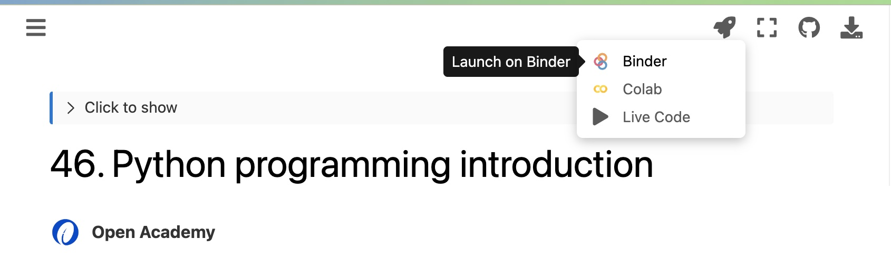

# Slides

The slides are built by using [RISE](https://rise.readthedocs.io/en/stable/). To enter live slideshow mode, please launch the slide notebook through mybinder.



---

```{tableofcontents}

```
