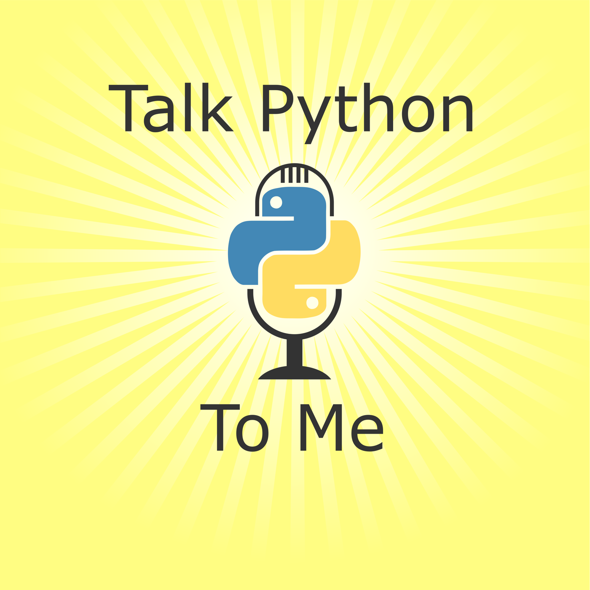
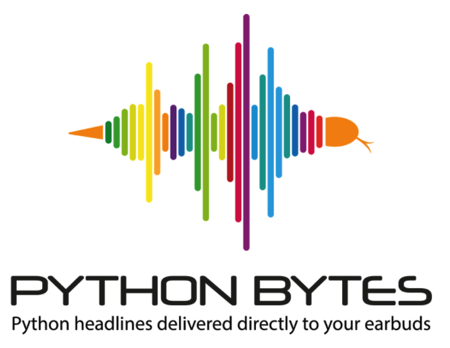
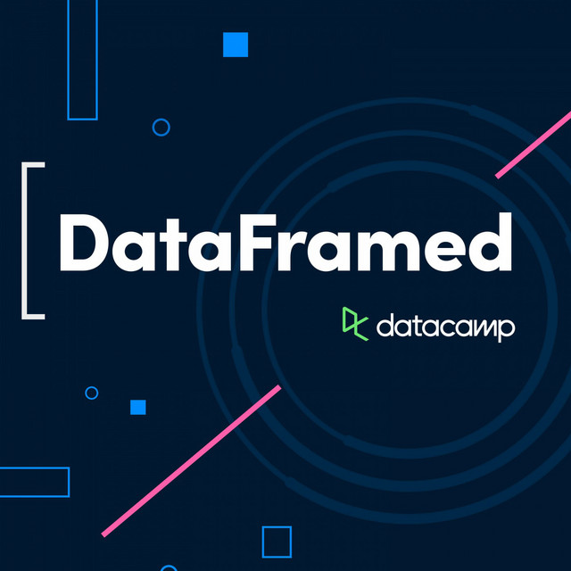
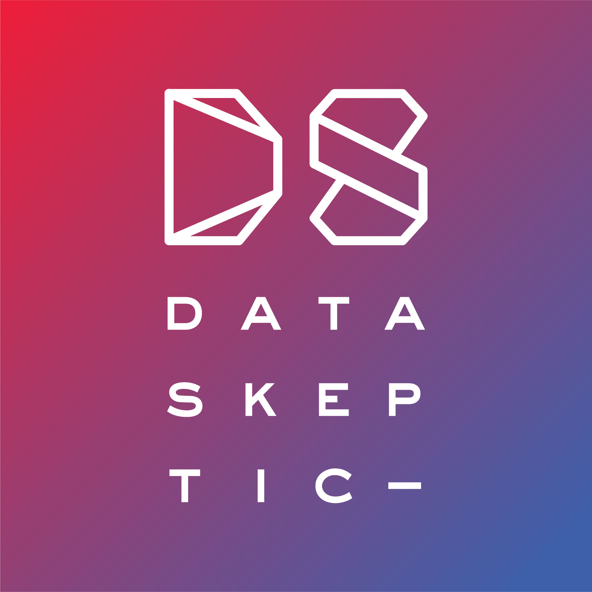
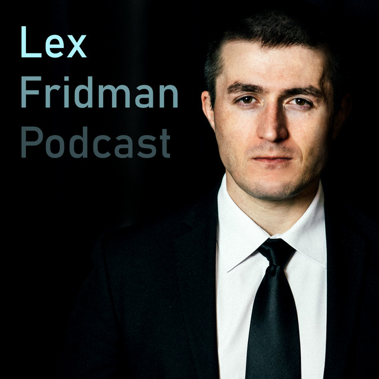
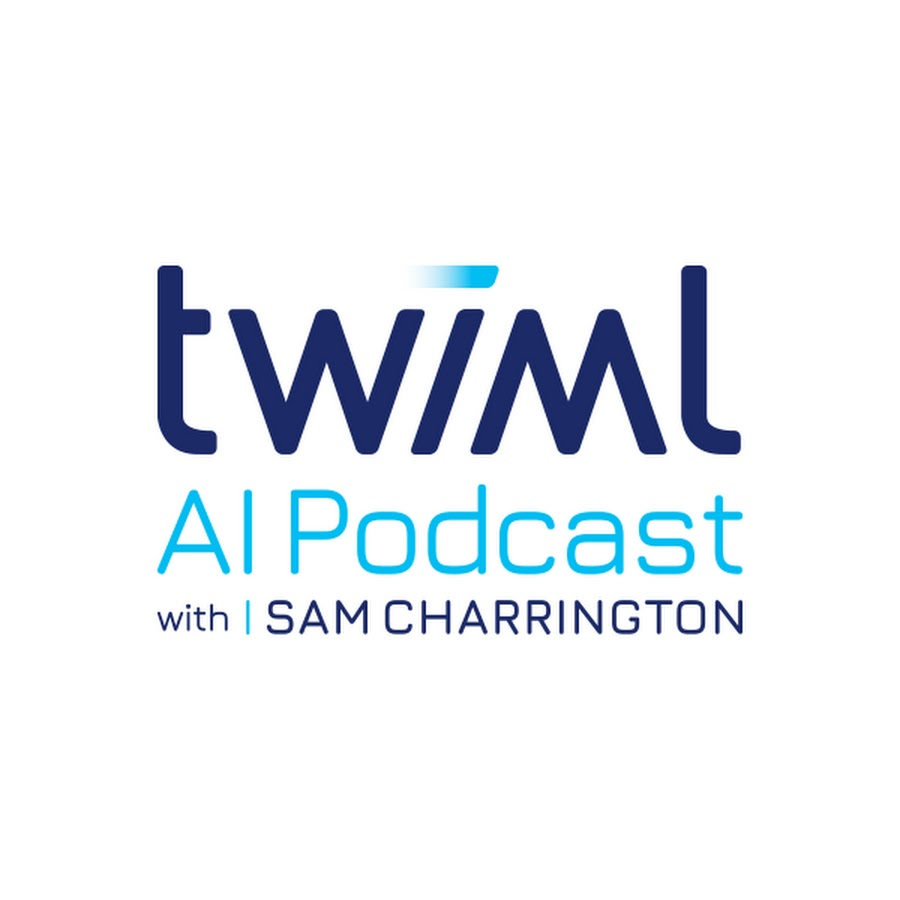
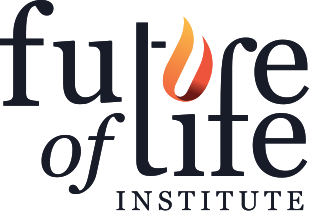
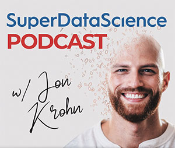
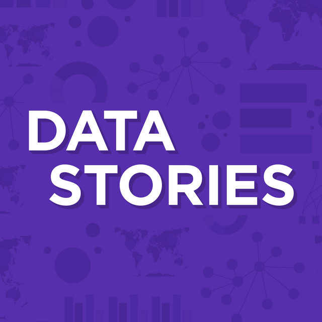
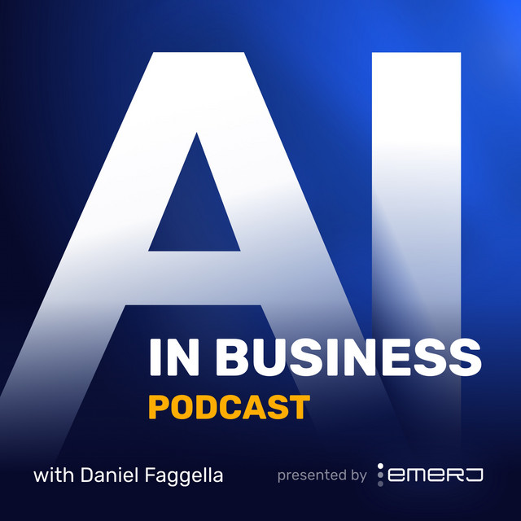

# 10 Data Science Podcasts to Listen to in 2023

With the exponential growth of data and AI technology, it's more important than ever to stay up-to-date on the latest advancements and best practices. For busy professionals and enthusiasts alike, podcasts are the perfect medium for learning by osmosis and exposure to expert perspectives.

To help you make the most of your listening, Ocademy has compiled some of the top podcasts covering everything from Python programming to data ethics. We will tell you what we like about the podcast, and you can catch a glimpse of what this podcast is about with the latest episode (as of August 2023). Consider adding these podcasts to your queue if you're looking to enhance your abilities and perspective in an efficient way！

## [Talk Python To Me](https://talkpython.fm/)

❤️**What we love**: Host Michael Kennedy skillfully highlight all aspects of Python, interviewing experts to provide listeners with a wealth of knowledge in software development.

🎧**Latest episode**: "10 Tips and Ideas for the Beginner to Expert Python Journey" Well, it doesn't get better than that.

## [Python Bytes](https://pythonbytes.fm/)

❤️**What we love**: The 2nd podcast created by Talk Python To Me creators. Get your Python fix in just 30 minutes. This podcast provides quick insights into the Python world.

🎧**Latest episode**: "Djangonauts: Ready for Takeoff!" where they talk about Djangonauts, a group-learning open-source community, Python in Excel, and more.

## [DataFramed](https://www.datacamp.com/community/podcast)

❤️**What we love**: Through interviews with experts, this Datacamp podcast covers a wide range of topics, including data ethics, machine learning, and data visualization.

🎧**Latest episode**: "How Data Science Can Sustain Small Businesses with Kendra Vant, Executive GM Data & AI Products at Xero", where they delve into the transformative impact of data science on small businesses.

## [Data Skeptic](https://dataskeptic.com/)

❤️**What we love**: This podcast makes complex data science concepts accessible to everyone. It alternates between interviews with experts and mini-episodes explaining high-level concepts in layman terms.

🎧**Latest episode**: "Which Professions are threatened by LLMs with Daniel Rock, an Assistant Professor at the Wharton School of the University of Pennsylvania", where they talk about how AI has disrupted the job market in the past years and had created more winners than losers.

## [Lex Fridman Podcast](https://lexfridman.com/ai/)

❤️**What we love**: Fridman's in-depth conversations with the world's leading minds in AI and other fields make this podcast a must-listen.

🎧**Latest episode**: "Joscha Bach: Life, Intelligence, Consciousness, AI & the Future of Humans" 

## [This Week in Machine Learning & AI ](https://twimlai.com/)

❤️**What we love**: The conversations with top researchers and thought leaders are always engaging. They cover a wide range of AI topics so there's always something that you find relevant.

🎧**Latest episode**: "Inverse Reinforcement Learning Without RL with Gokul Swamy" where they explore the challenges and benefits of inverse reinforcement learning, and the potential and advantages it holds for various applications.

## [The AI Alignment Podcast](https://futureoflife.org/project/future-of-life-institute-podcast/)

❤️**What we love**: A Future of Life Institute podcast, this podcast invites leading researchers to discuss AI alignment, policy and safety. A perfect podcast for those interested in the ethical side of AI.

🎧**Latest episode**: "Robert Trager on International AI Governance and Cybersecurity at AI Companies", where they discuss international AI governance, the security dilemma in AI, cybersecurity at AI companies, and skepticism about AI governance.

## [SuperDataScience](https://www.superdatascience.com/podcast)

❤️**What we love**: This podcast targets both beginners and pros, offering technical overviews, career advice, and industry news. Their offer super practical tech.

🎧**Latest episode**: "Vicuña, Gorilla, Chatbot Arena and Socially Beneficial LLMs, with Prof. Joey Gonzalez" speaks about LLM models and platforms, how Berkeley students leveraged the Llama LLM with data from ShareGPT to produce Vicuña, smart ways to evaluate and rank LLM models, and the prospects for AI and open-source options in the near future.

## [Data Stories](https://datastori.es/)

❤️**What we love**: This podcast covers data visualization, making it unique among data podcasts.

🎧**Latest episode**: "Formalizing Design with Gabrielle Mérite and Alan Wilson" discuss data design systems and styleguides, which are currently a huge trend in the data design world.

## [AI in Business Podcast](https://emerj.com/artificial-intelligence-podcast/)

❤️**What we love**: This podcast is great for business leaders to understand critical trends and applications of AI. Helps understand which AI applications are driving real business value, and which are still experimental.

🎧**Latest episode**: "Telling Fact from Fiction in Launching Enterprise AI and Bespoke LLMs - with Alberto Rizzoli of V7" discusses what generative AI capabilities will mean across industries and the biggest challenges facing enterprise leaders trying to integrate bespoke gen AI models into their organizations.

So there you have it - our top 10 podcasts to keep you informed and entertained in the world of AI, data science, and Python.
Happy listening!
